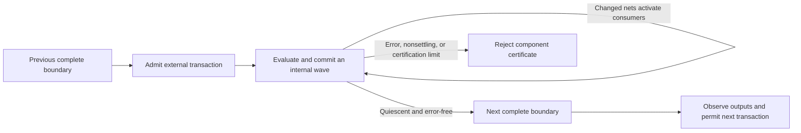
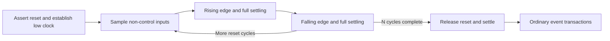
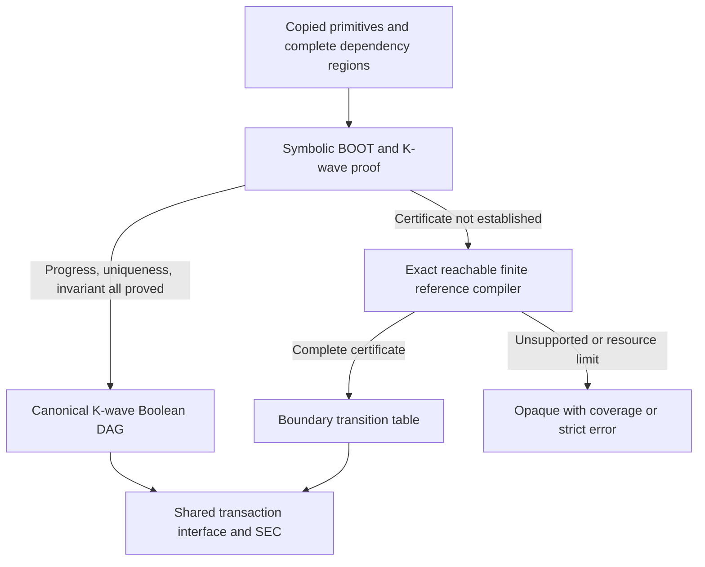

# SEC Latch Event Implementation

This document describes the deterministic Boolean-event implementation of the
[latch-support design](sec-latch-support.md). It includes an executable reference,
**SAT-certified symbolic bounded unfolding**, an independent exhaustive finite
compiler, dependency-closed scheduling regions, parallel wave evaluation, and
SEC integration. It is not a timing-accurate model of arbitrary asynchronous
circuits. Optional phase abstraction and stronger scheduling reductions are not
required by, or enabled in, this implementation.

The master switch is `latch_support: true` in YAML or `--latch_support` on the
command line. It is **off by default**. New latch extraction and supplemental
Liberty latch modeling are behind this switch; leaving it off preserves the
existing SEC path and its opaque-latch behavior. In particular, with
`latch_support` off, `sec_reset` uses the unchanged legacy reset-bootstrap path;
none of the event adapter's clock-discovery, initialization, or single-reset-port
requirements apply.

## 1. Enabling the model requires an explicit contract

The master switch does not select an initialization or input-event assumption.
An enabled run must also provide all three fields below:

```yaml
format: verilog
verification: sec
input_paths: [reference.v, implementation.v]
liberty_files: [cells.lib]

latch_support: true
sec_latch_events:
  input_changes: any
  initial_inputs: 0
  initial_storage: 0
```

`initial_inputs` sets **every external input** to the specified Boolean value
before initialization. `initial_storage` sets **every modeled primitive storage
bit** to its specified value. Each accepts only `0` or `1`; these are separate
choices, not per-port mappings. They describe a particular initial-state
contract, not a proof that arbitrary power-up state reaches reset.

| Purpose | YAML | Command-line option |
| --- | --- | --- |
| Master enable, default off | `latch_support: true` | `--latch_support` |
| Allowed external transactions | `sec_latch_events.input_changes: any` or `single` | `--sec-latch-events any` or `single` |
| Initial value of all external inputs | `sec_latch_events.initial_inputs: 0` or `1` | `--sec-latch-initial-inputs 0` or `1` |
| Initial value of all primitive storage bits | `sec_latch_events.initial_storage: 0` or `1` | `--sec-latch-initial-storage 0` or `1` |
| Optional strict opacity policy, default off | `error_on_opaque: true` | `--error-on-opaque` |

The `sec_latch_events` fields and `--sec-latch-*` tuning flags do **not** enable
latch support by themselves. Providing tuning while the master switch is off
is rejected, as is an enabled run with an incomplete contract. The strict
opaque policy is independent of the master latch switch:
it can also be used with ordinary SEC.

### `any` and `single` are different verification assumptions

- `any` permits every Boolean valuation of a component's external inputs at
  each transaction, including several simultaneous changes and no change.
- `single` permits at most one original top-level input bit to change per
  transaction, including no change. It is an explicit restriction on the
  environment, not an inferred property of the circuit.

With `any`, a data change concurrent with a latch closing can produce two
different retained values. Such a component remains opaque if the complete
boundary result is not unique. Selecting `single` is legitimate only when that
restricted environment is the intended proof contract; it is not a sound way
to waive races in a design that must tolerate simultaneous external changes.

Even in `single` mode, one external change can generate several simultaneous
internal changes. All permitted changed-pin orders inside the component remain
part of certification. The setting does not impose a one-pin-change assumption
on latch data, enables, internal clocks, or asynchronous controls.

## 2. What one SEC step means

One step supplies a permitted external transaction, holds those external values
fixed, and completes all internal propagation before the next observation.
The environment cannot interrupt an unfinished settling episode.



Consequently, `max_k` and counterexample steps count **external transactions**,
not clock cycles or internal waves. An independent enable can open and close
between flip-flop edges through separate transactions. Data changes while a
latch is open also propagate without requiring a flip-flop edge.

Selected leaf boundaries remain unsupported. Asynchronous reset/set pins
participate in the event model as external or internally generated controls.
**`sec_reset.cycles` still means clock cycles**, using the automatic adapter
below; it never means an arbitrary count of input events or settling waves. BTOR2 export
uses the compiled transaction transition system and records the event contract;
outside the reset prefix its steps must not be interpreted as hardware clock
ticks. Counterexample reports distinguish reset cycles from **event transactions**
and print the contract.

### Reset-cycle adapter

The existing reset configuration can be used with latch support:

```yaml
latch_support: true
sec_latch_events:
  input_changes: single
  initial_inputs: 0
  initial_storage: 0
sec_reset:
  cycles: 3
  ports:
    - name: rst
      active_value: 1
```

The clock is discovered from explicit flip-flop clock expressions and exact
combinational routing, not from names or arbitrary latch enables. The initial
automatic subset requires one common top-level clock root, allowing direct,
buffered, and inverted routes and both sampling polarities. Clock discovery
only supplies the reset stimulus: latches still use the full event model, not
a phase-register approximation.

Each of the N reset cycles composes these already-certified transactions:

1. Assert reset and settle. Put the source clock low and settle. If initialization
   placed it high, this establishes the low starting phase while reset is active;
   that alignment edge is represented, not silently discarded.
2. Sample unconstrained levels for **all** non-clock/non-reset inputs, preserving
   the reset environment's free data inputs. With `any`, admit the entire vector
   as one transaction. With `single`, assign each sampled input through its own
   settled transaction, with additional shared environment choices covering every
   arrival order. There is no fixed favorable order and no one-input-per-cycle
   restriction. The sampled levels are then held during the two clock edges.
3. Drive the source clock high and fully settle all affected logic and storage.
4. Drive it low and fully settle again. This completes one clock cycle, including
   positive- and negative-edge state updates and intervening latch transparency.
5. After the final cycle, deassert reset and settle before normal checking resumes.



A saturating countdown implements this prefix; the compiler does not build N
copies of the full reset logic. Outputs are compared only after the prefix,
as with reset bootstrap. The countdown must finish after exactly N macrosteps,
and each composed event already has a universal progress certificate, so the
mask cannot hide a non-settling modeled reset execution. The requested post-reset
`max_k` budget is retained by extending the engine bound by N.

Composition is not free: with m non-control input bits, `single` reset sampling
composes m event transitions plus a fixed number of clock/reset transitions,
and the total arrival-order selector construction has quadratic work in m.
The existing `max_symbolic_nodes` budget also bounds the cumulative expression
DAG visited during reset composition (not peak process memory); excessive
ordering work is rejected before construction. Exceeding that budget reports
unsupported reset adaptation rather than choosing a subset of input orders.

Afterward, clocks resume ordinary event-driven behavior and reset is held inactive,
matching existing reset-bootstrap policy. A requested reset change is ignored by
the effective input adapter (a stutter for the selector interface); witness input
bits must be read with this constraint. For exported models and witnesses, the
first N steps are **reset clock cycles** and subsequent steps are **external event
transactions**. Contract metadata and witness headers record this distinction.
In the selector interface, the original top-input interface variables provide
the sampled levels during reset, while extra reset-order inputs specify their
arrival order; after the prefix only the usual selector/value inputs drive events.
This is a cycle-sampled reset environment, not unrestricted glitch timing inside
a cycle. All such input-arrival choices are shared external stimulus for the two
designs, not private internal scheduling choices discarded by the certifier.

The first automatic adapter supports **one reset port**. Multiple reset ports
would require a justified assertion/release ordering; multiple independent clock
roots require a defined schedule. Gated/state-generated/ambiguous clock roots,
clockless latch-only designs, unsupported primitive clock metadata, and a reset
port used as its own clock are rejected with specific diagnostics. These limits
affect automatic reset-cycle expansion, not ordinary event-mode reset signals.
No clock is guessed and no reset configuration silently falls back to N events.

The adapter composes copies of the certified boundary-to-boundary transition,
preserving complete state between events. It therefore inherits progress and
determinism from those certificates. This is a Kepler integration construction,
not a claim that the cited papers prescribe this particular reset protocol.

Both comparison designs use the same contract, even if one contains no latches.
Contract metadata prevents mixing ordinary clock-cycle models, event models,
or incompatible Boolean initialization contracts. Original top-input identities
remain part of interface alignment, so a selector cannot silently refer to
different pins on the two sides.

This is zero-delay Boolean behavior under the declared primitive granularity.
It does not cover propagation delays, setup/hold violations, metastability,
HDL X/Z behavior, multiple drivers, or all IEEE Verilog scheduling semantics.
Replacing one modeled primitive with a gate decomposition may move events
between waves and therefore needs more than a Boolean-function equivalence
argument.

## 3. Extraction and primitive modeling

The ordinary Liberty reader is augmented, only in the enabled file-based path,
with explicit scalar `latch` groups. The supplemental reader preserves data,
enable, asynchronous clear/preset, conflict behavior, and physical output
expressions. An integrated clock gate is supported through its actual latch
and output expressions, such as a stored enable ANDed with a clock; neither
cell names nor `clock_gating_integrated_cell` metadata alone establish those
semantics. Unsupported library descriptions remain unmodeled.

The Naja adapter copies explicit sequential expressions and supported Boolean
truth tables into pure primitive callbacks. Worker evaluations do not access
the original Naja objects. This also allows compact extraction to release the
source design after constructing its SEC model.

Explicit constant nets do not need a cell driver. If flattened connectivity
omits their equipotential entry, a read-only connected-hierarchy walk resolves
consistent Boolean annotations. Floating, X/Z, conflicting, or unexpectedly
driven nets do not silently become constants; the original netlist and its
flattened connectivity are not modified.

The accepted subset is intentionally conservative:

- Physical output mappings and clear/preset behavior must be defined. Undefined
  simultaneous controls become errors if reached, not don't-cares. A reached
  simultaneous clear/preset `Toggle` rule is also unsupported: its implicit
  state-dependent asynchronous activity is not represented by pin events alone.
- Latch data and asynchronous control expressions may not depend directly on
  internal state variables in a way requiring unmodeled internal feedback.
  Such definitions are rejected by the adapter. Feedback through actual net
  connections is handled by the event model and certification.
- Flip-flop next-state expressions may use stored state, because their update
  is explicitly edge-triggered. Clock/enable expressions cannot depend on
  internal state variables.
- Unmodeled primitives, unsupported generic arithmetic/table-select models,
  unsupported state-table descriptions, invalid pin mappings, and missing or
  multiple drivers do not silently acquire new semantics.

Each component contains every primitive connected through internally driven
data **or control** nets, including enable, clock, and asynchronous controls.
This deliberately groups more than just feedback strongly connected components.
Shared read-only primary inputs do not by themselves join otherwise independent
components. A component can contain latch chains, feedback loops, combinational
logic, and flip-flops.

Dependency analysis also identifies directed feedback SCCs, including self-loops,
separately from these undirected event-connected components. Both analyses are
iterative and deterministically ordered. SCC membership is structural information,
not a termination certificate, and a flip-flop is not an unconditional cut of its
generated clock or asynchronous-control dependencies. The first implementation
certifies whole event-connected components; it never invents independent local
settling bounds from SCC sizes.

This conservative closure prevents a component's temporary pulse from being
discarded at a neighboring storage element. It is not an implementation of
arbitrary independently settling local islands or final-output-only summaries.

## 4. Initialization and internal waves

Initialization is itself a checked settling episode:

1. Install the explicit initial external values and primitive storage values.
2. Initialize physical storage outputs from their model; universally quantify
   auxiliary internal net seeds rather than choosing convenient values. The
   finite reference compiler enumerates them; the symbolic compiler uses
   unconstrained Boolean variables.
3. Set previous values equal to initial current values, so merely beginning
   with a high external clock does not invent a rising edge.
4. Force a BOOT evaluation. Gates evaluate, latches apply level-sensitive and
   asynchronous rules, and flip-flops apply asynchronous rules without an
   invented edge. Generated clock changes from that update remain real modeled
   events in subsequent waves.
5. Certify that all auxiliary seed choices and permitted event orders settle
   to the same complete boundary for the prescribed intended initialization.

When a physical output's initial projection reads input pins, certification
also quantifies seeds of other storage-output nets that the projection can
read before they are overwritten. Otherwise those hidden seed choices could
determine the retained result.

The standalone compiler can enumerate unspecified initial storage and retain
every origin mapping. The first integrated CLI path instead requires explicit
fixed Boolean input/storage settings and one initialized boundary per component;
it does not select a favorable member of an unspecified initial relation.

Within an ordinary wave, activated primitives read the same frozen snapshot.
A sequential primitive processes every permitted ordering of changed input
positions, applying each change once. A flip-flop edge is not reused when a
later data pin is visited. The final primitive storage/output tuple is staged;
all staged tuples commit at the wave boundary. Changed nets activate all their
consumers for the next wave. Primitive-local intermediate pin-processing values
are private under this contract, but transitions between network waves are not
discarded.

Independent primitive evaluations within a wave run through TBB. They read
immutable inputs and stage separate results, so worker completion order cannot
choose a latch capture. A producer's chosen result is shared across its fanout,
not resampled independently for each consumer. The complete-wave update barrier
preserves the reference epochs.

## 5. Certification and compilation

### 5.1 Symbolic bounded unfolding (first choice)

The symbolic model mirrors the reference's complete state, BOOT, admission,
pin-order choices, sticky errors, frozen snapshots, and update barriers. Primitive
expressions are copied directly into Boolean DAGs. Generic AND/OR/XOR families
are linear-size constructions; small explicit library truth tables are local
expansions, not circuit-wide input or state enumeration.

Each wave allocates fresh ordering selectors before parallel evaluation. Every
selector encoding denotes a legal pin order, including otherwise unused binary
codes. Unchanged pins are skipped; restricting a full-pin permutation in this
way represents every changed-pin permutation. A producer's choice is shared
across all fanout. Errors remain nonstable, and completed states have exact
identity successors.

For each component:

1. Retain every current net bit and primitive storage bit in the macrostate.
   At completed boundaries, previous=current and active=BOOT=error=0, so those
   omitted fields are exactly reconstructible, not discarded history.
2. Construct candidate invariant `B`: a normalized error-free boundary with
   consistent constants, where forced no-edge evaluation of each primitive
   preserves its storage and physical outputs. This overapproximates reachable
   boundaries; it is **proved**, not assumed, to hold after initialization and
   to be inductive.
3. Unfold BOOT from the specified input/storage values, quantifying independent
   auxiliary seeds and every permitted pin order. Try increasing bounds up to
   `max_waves`; prove `not Stable(xK)` UNSAT. Independently seeded/ordered copies
   must also have the same **complete** boundary, and that boundary must satisfy B.
4. Share symbolic pre-admission `q` and external input `u` between two ordinary
   episodes. Under `B(q) AND Allowed(q,u)`, prove bounded progress, complete-state
   outcome uniqueness with independent ordering choices, and `B(next)` closure.
   `single` constrains admission only, never internally generated pin changes.
5. Only after those obligations succeed, rebuild the same K waves using one
   legal canonical pin order and a legal BOOT seed. Uniqueness justifies removing
   the choices. Export no seed/choice variables. The certificate retains its
   admission contract and external-net mapping; encoding cannot change either.
6. Substitute SEC state/input variables simultaneously into the compiled DAG,
   with shared subexpressions retained. This logic is built once, not regenerated
   on each transaction. The SEC engines prove arbitrarily long boundary traces
   using these next-state and observation expressions.

These are ordinary SAT safety obligations over the finite symbolic relation,
using CaDiCaL with cumulative conflict/decision budgets. SAT at an insufficient
bound is not proof of oscillation. A failure found only from the overapproximate
invariant is an **unproved certificate**, not a reachable design defect. UNKNOWN
or resource exhaustion cannot become a successful certificate.



### 5.2 Exact finite reference and fallback

For each component the compiler performs exhaustive finite-state analysis,
subject to explicit resource limits:

1. Certify the initialization episodes and retain their complete stable states.
2. From each reachable complete boundary, enumerate every permitted external
   transaction, including stutters, and admit it into the event model.
3. Explore every reachable internal state and successor. The retained state
   includes current/previous net values, primitive storage, activations, BOOT,
   and errors; equal visible outputs do not imply equal state.
4. Require totality. Missing successors and reachable errors fail certification.
   Stable states must have identity successors, so early completion can be
   padded without changing history or hiding a failure.
5. Detect reachable nonstable cycles. A cycle with an exit still permits an
   infinite execution and therefore fails universal settling.
6. For an acyclic episode graph, calculate the longest path to stability. It is
   an exact sufficient wave bound, not a guessed latch count or shortest path.
7. Require one **complete** stable boundary for the transaction. Different
   retained storage or history is rejected even if present outputs agree.
8. Add the boundary-to-boundary row and continue until the reachable boundary
   set is closed under every permitted transaction.

No partial table is returned as certified. Resource exhaustion, an excessive
wave bound, a race, or a nonsettling execution cannot be turned into an
assumption that removes the troublesome input from the proof.

The accepted table is encoded into Boolean next-state and observation formulas
for the existing SEC engines. Its boundary IDs are injective identifiers of
complete states, including remembered input values and history. Output formulas
describe the completed observation of the incoming transaction. Unused IDs have
a total encoding but are unreachable from the explicitly initialized, closed
table.

In `single` mode, both designs share selector bits and one value bit. The selector
names an original top input; that input is assigned the value. Selecting an
unrelated component's input, selecting a reserved/out-of-range code, or assigning
the existing value produces the appropriate local stutter. The input interface
is aligned before verification. Counterexample inputs therefore include these
synthetic selector/value signals; they are not a complete ordinary input-vector
sample at each step.

For those witnesses, `$event.select[i]` contributes bit `i` of the zero-based
selector, with bit zero least significant. Original top input names, including
their bit indices, are sorted lexicographically to define that selector order.
`$event.value` supplies the assigned Boolean value. The retained
original input-interface variables are alignment sentinels outside the reset
prefix; their witness values do not drive ordinary event transactions. During
the optional reset prefix they instead supply the sampled levels, as described
in the reset-cycle adapter above.

The exact subject of the symbolic `K`-copy unfolding is the declared
Boolean-event contract, not unrestricted physical latch networks. It avoids the finite
fallback's whole-state/input enumeration, but SAT cost and unfolded DAG size
can still grow substantially. Either backend may certify a component; if neither
does, opacity is preserved. The finite backend is also an independent oracle
for differential tests of the symbolic compiler. Stronger regional summaries
and phase abstraction remain optional future reductions.

## 6. Resource controls

The following limits can be tuned through `sec_latch_events`, the corresponding
CLI flags, or the Python options in Section 8:

| Setting | Default | Scope |
| --- | ---: | --- |
| `max_waves` / `--sec-latch-max-waves` | 256 | Maximum accepted settling depth of an episode |
| `max_symbolic_nodes` / `--sec-latch-max-nodes` | 2,000,000 | Cumulative visited symbolic DAG nodes, including proof copies; also the reset-composition budget |
| `max_sat_conflicts` / `--sec-latch-sat-conflicts` | 500,000 | Cumulative symbolic certification SAT conflicts |
| `max_sat_decisions` / `--sec-latch-sat-decisions` | 5,000,000 | Cumulative symbolic certification SAT decisions |
| `max_states` / `--sec-latch-max-states` | 4,096 | Finite fallback: reachable complete boundaries per component |
| `max_transactions` / `--sec-latch-max-transactions` | 65,536 | Finite fallback: boundary/input rows per component |
| `workers` / `--sec-latch-workers` | 0 | Automatic TBB worker selection; `1` selects serial evaluation |

The symbolic node budget is not a hard process-memory ceiling: temporary nodes
may be constructed inside a wave before accounting, and the shared expression
cache has its own lifetime. SAT budgets and certification node limits apply per
component. Reset composition separately applies the node budget to each complete
design's adapted model.

Other conservative finite-compiler/reference limits currently live in the
standalone API, not in additional YAML keys. The 100,000 local pin-permutation
limit also applies to symbolic sequential primitives; gates do not enumerate
pin orders:

| Resource | Default |
| --- | ---: |
| Complete reference-state Boolean bits | 512 |
| Reachable internal states per episode | 65,536 |
| Successor transitions explored per episode | 262,144 |
| Enumerated external input bits per component | 12 |
| Unspecified initial-storage bits | 12 |
| Auxiliary bootstrap seed bits | 12 |
| Initial storage/seed configurations | 4,096 |
| Changed-pin permutations per primitive activation | 100,000 |
| Combined successor alternatives per wave | 100,000 |

`max_states` is not the internal episode-state limit. Raising one setting does
not disable the others or guarantee that a component becomes tractable.
The symbolic path is not subject to the finite fallback's 12-input/seed-bit or
512-complete-state-bit limits; selecting a tiny finite-table limit alone does
not disable symbolic certification.
These limits reject unproved cases; they do not truncate the relation while
claiming a successful certificate.

Certification of the event model does not guarantee that an SEC engine can
prove equivalence within its own bound and resource limits. Retained event
history and reset-counter bits also contribute to backend state size. An
inconclusive backend result remains inconclusive; it is not equivalence and
does not justify restricting the event or reset-input contract.

## 7. Opacity, errors, and coverage

With latch support disabled, the existing extraction path remains in use.
With it enabled, a certified component is modeled; an unsupported or uncertified
component remains opaque, with reasons and affected output skipping. Independent
supported outputs can still be checked. Skipped outputs are not proved, and a
partial result is not a claim that an excluded nonsettling component terminates.

Diagnostics distinguish a proven nonsettling cycle, distinct complete boundary
results, an invalid reference/primitive case, exhausted resources, and a settling
depth beyond the accepted bound. A resource limit is not evidence of oscillation.

`error_on_opaque: true` or `--error-on-opaque` changes the policy to a hard
unsupported result with a nonzero exit and an identified design/signal/reason.
It is default-off, applies to general opaque cells/signals rather than just
latches, and is checked in either design, including disconnected opaque cells.
It does not reclassify every unrelated connectivity skip as an opaque cell.

Invalid global configuration, incompatible contracts, and unsupported whole-run
interfaces are rejected rather than represented as a successfully modeled event
run. Borrowed-design calls explicitly scope their own settings; they do not
inherit a caller's ambient event contract or leak their settings back to it.

## 8. Borrowed C++ and Python APIs

The Python interface uses the same default-off gate and explicit contract:

```python
from kepler_formal import VerificationOptions

options = VerificationOptions(
    mode="sec",
    latch_support=True,
    latch_input_changes="single",
    latch_initial_inputs=0,
    latch_initial_storage=0,
)
```

Optional fields are `latch_workers`, `latch_max_waves`, `latch_max_states`,
`latch_max_transactions`, `latch_max_symbolic_nodes`, `latch_max_sat_conflicts`,
and `latch_max_sat_decisions`. `latch_workers=0` selects automatic parallelism;
proof budgets must be positive. Invalid types, missing contract fields, tuning
without enablement, non-SEC mode, and selected leaf boundaries are rejected.
The independent `error_on_opaque` option remains default-off.

The native C++ equivalent is `BorrowedDesignOptions::latchSupport`, a validated
`BorrowedLatchOptions` object. Borrowed APIs consume the caller's explicit Naja
models; they do not load Liberty files or guess latch semantics. Source models,
selected tops, DNL pointers/order IDs, and ambient configuration are restored
after success or failure. Matching-runtime native and Python tests run through
`regress/run_python_regress.py`, without modifying installed Python packages.

## 9. Implementation map and verification

| File | Responsibility |
| --- | --- |
| `src/bin/LatchEventConfig.*` | Master enable, explicit contract, tuning, and CLI/YAML validation |
| `src/bin/LibertyLatchModels.*` | Opt-in supplemental scalar Liberty latch descriptions |
| `src/sec/latch/NajaEventPrimitive.*` | Copy supported Naja primitive expressions into immutable callbacks |
| `src/sec/latch/LatchConstantNet.h` | Read-only resolution of driverless Boolean constants, preserving conflict diagnostics |
| `src/sec/latch/LatchEventModel.*` | Boolean BOOT/admission/wave semantics, complete state, parallel primitive evaluation |
| `src/sec/latch/LatchSettlingCompiler.*` | Exhaustive settling/uniqueness checks and reachable macro-transition table |
| `src/sec/latch/LatchSymbolicModel.*`, `NajaSymbolicLogic.h` | Exact symbolic waves and direct primitive DAGs |
| `src/sec/latch/LatchSymbolicCompiler.*` | SAT-certified progress, BOOT independence, uniqueness, closure, and bounded unfolding |
| `src/sec/latch/LatchSymbolicEncoding.*` | Certified contract checks and simultaneous SEC-variable substitution |
| `src/sec/latch/LatchDependencyGraph.*` | Iterative feedback SCCs and event-connected scheduling components |
| `src/sec/latch/LatchResetClock.*`, `LatchResetAdapter.*`, `LatchInputHistory.h` | Automatic source-clock discovery, remembered levels, and reset-cycle composition |
| `src/sec/latch/LatchBoundaryEncoding.*` | Injective boundary-state encoding and shared event-input decoding |
| `src/sec/latch/LatchNetlistAdapter.*` | Full data/control component closure, extraction, opacity, and SEC integration |
| `src/sec/latch/LatchSupportOptions.*`, `LatchEventContract.h` | Scoped options and protection against incompatible step/initialization contracts |
| `src/sec/model/OpaquePolicy.*` | Independent default-off error-on-opaque policy |
| `src/python/BorrowedLatchOptions.*`, `PyLatchOptions.*`, `kepler_formal/_latch_options.py` | Typed borrowed/Python contract validation and scoped activation |

New tests cover the reference waves, latch chains and feedback, initialization
seed dependence, all permitted pin orders, transient controls, serial/parallel
agreement, exhaustive small-graph certification, resource failures, table
encoding, original-input alignment, Naja/Liberty adapters, and configuration and
opacity policies. Symbolic tests compare complete states with concrete reference
successors and exact table rows, test long/wide networks beyond enumeration
limits, independent proof choices and seed copies, invariant overapproximation,
hidden-state races, SAT/resource failures, and contract-preserving export.
Test names are in the new `Latch*Tests.cpp`, `OpaquePolicy*Tests.cpp`, and Python
latch suites. Optional reductions and unrestricted timing models are not implied
by completion of this deterministic Boolean-event implementation.

For the sources, conditional proof arguments, and remaining theoretical
extensions, see [the design and literature references](sec-latch-support.md).
Those references motivate the construction; the exact Boolean initialization,
barrier semantics, compiler, and adapter are Kepler implementation choices whose
correctness must be checked against the stated contract.
