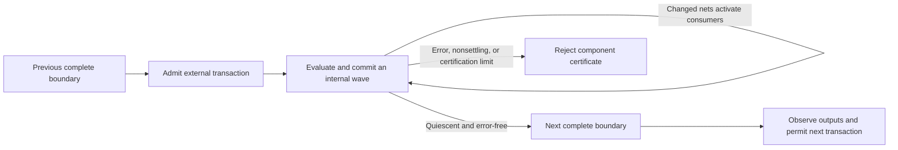

# SEC Latch Event Implementation

This document describes the first implementation of the
[latch-support design](sec-latch-support.md). It is an **opt-in, finite Boolean
event model with exhaustive certification and table-based compilation**. It is
not an implementation of every proposed optimization, a scalable symbolic
settling prover, or a timing-accurate model of arbitrary asynchronous circuits.

The master switch is `latch_support: true` in YAML or `--latch_support` on the
command line. It is **off by default**. New latch extraction and supplemental
Liberty latch modeling are behind this switch; leaving it off preserves the
existing SEC path and its opaque-latch behavior.

## 1. Enabling the model requires an explicit contract

The master switch does not select an initialization or input-event assumption.
An enabled run must also provide all three fields below:

```yaml
format: verilog
verification: sec
input_paths: [reference.v, implementation.v]
liberty_files: [cells.lib]

latch_support: true
sec_latch_events:
  input_changes: any
  initial_inputs: 0
  initial_storage: 0
```

`initial_inputs` sets **every external input** to the specified Boolean value
before initialization. `initial_storage` sets **every modeled primitive storage
bit** to its specified value. Each accepts only `0` or `1`; these are separate
choices, not per-port mappings. They describe a particular initial-state
contract, not a proof that arbitrary power-up state reaches reset.

| Purpose | YAML | Command-line option |
| --- | --- | --- |
| Master enable, default off | `latch_support: true` | `--latch_support` |
| Allowed external transactions | `sec_latch_events.input_changes: any` or `single` | `--sec-latch-events any` or `single` |
| Initial value of all external inputs | `sec_latch_events.initial_inputs: 0` or `1` | `--sec-latch-initial-inputs 0` or `1` |
| Initial value of all primitive storage bits | `sec_latch_events.initial_storage: 0` or `1` | `--sec-latch-initial-storage 0` or `1` |
| Optional strict opacity policy, default off | `error_on_opaque: true` | `--error-on-opaque` |

The `sec_latch_events` fields and `--sec-latch-*` tuning flags do **not** enable
latch support by themselves. Providing tuning while the master switch is off
is rejected, as is an enabled run with an incomplete contract. The strict
opaque policy is independent of the master latch switch:
it can also be used with ordinary SEC.

### `any` and `single` are different verification assumptions

- `any` permits every Boolean valuation of a component's external inputs at
  each transaction, including several simultaneous changes and no change.
- `single` permits at most one original top-level input bit to change per
  transaction, including no change. It is an explicit restriction on the
  environment, not an inferred property of the circuit.

With `any`, a data change concurrent with a latch closing can produce two
different retained values. Such a component remains opaque if the complete
boundary result is not unique. Selecting `single` is legitimate only when that
restricted environment is the intended proof contract; it is not a sound way
to waive races in a design that must tolerate simultaneous external changes.

Even in `single` mode, one external change can generate several simultaneous
internal changes. All permitted changed-pin orders inside the component remain
part of certification. The setting does not impose a one-pin-change assumption
on latch data, enables, internal clocks, or asynchronous controls.

## 2. What one SEC step means

One step supplies a permitted external transaction, holds those external values
fixed, and completes all internal propagation before the next observation.
The environment cannot interrupt an unfinished settling episode.



Consequently, `max_k` and counterexample steps count **external transactions**,
not clock cycles or internal waves. An independent enable can open and close
between flip-flop edges through separate transactions. Data changes while a
latch is open also propagate without requiring a flip-flop edge.

The current event path rejects clock-cycle reset bootstrap and selected leaf
boundaries. Asynchronous reset/set pins still participate in the event model
as ordinary external or internally generated controls; the existing
`sec_reset.cycles` mechanism is not reinterpreted as an event sequence. BTOR2 export
uses the compiled transaction transition system and records the event contract;
its steps must not be interpreted as hardware clock ticks.

Both comparison designs use the same contract, even if one contains no latches.
Contract metadata prevents mixing ordinary clock-cycle models, event models,
or incompatible Boolean initialization contracts. Original top-input identities
remain part of interface alignment, so a selector cannot silently refer to
different pins on the two sides.

This is zero-delay Boolean behavior under the declared primitive granularity.
It does not cover propagation delays, setup/hold violations, metastability,
HDL X/Z behavior, multiple drivers, or all IEEE Verilog scheduling semantics.
Replacing one modeled primitive with a gate decomposition may move events
between waves and therefore needs more than a Boolean-function equivalence
argument.

## 3. Extraction and primitive modeling

The ordinary Liberty reader is augmented, only in the enabled file-based path,
with explicit scalar `latch` groups. The supplemental reader preserves data,
enable, asynchronous clear/preset, conflict behavior, and physical output
expressions. An integrated clock gate is supported through its actual latch
and output expressions, such as a stored enable ANDed with a clock; neither
cell names nor `clock_gating_integrated_cell` metadata alone establish those
semantics. Unsupported library descriptions remain unmodeled.

The Naja adapter copies explicit sequential expressions and supported Boolean
truth tables into pure primitive callbacks. Worker evaluations do not access
the original Naja objects. This also allows compact extraction to release the
source design after constructing its SEC model.

The accepted subset is intentionally conservative:

- Physical output mappings and clear/preset behavior must be defined. Undefined
  simultaneous controls become errors if reached, not don't-cares. A reached
  simultaneous clear/preset `Toggle` rule is also unsupported: its implicit
  state-dependent asynchronous activity is not represented by pin events alone.
- Latch data and asynchronous control expressions may not depend directly on
  internal state variables in a way requiring unmodeled internal feedback.
  Such definitions are rejected by the adapter. Feedback through actual net
  connections is handled by the event model and certification.
- Flip-flop next-state expressions may use stored state, because their update
  is explicitly edge-triggered. Clock/enable expressions cannot depend on
  internal state variables.
- Unmodeled primitives, unsupported generic arithmetic/table-select models,
  unsupported state-table descriptions, invalid pin mappings, and missing or
  multiple drivers do not silently acquire new semantics.

Each component contains every primitive connected through internally driven
data **or control** nets, including enable, clock, and asynchronous controls.
This deliberately groups more than just feedback strongly connected components.
Shared read-only primary inputs do not by themselves join otherwise independent
components. A component can contain latch chains, feedback loops, combinational
logic, and flip-flops.

This conservative closure prevents a component's temporary pulse from being
discarded at a neighboring storage element. It is not an implementation of
arbitrary independently settling local islands or final-output-only summaries.

## 4. Initialization and internal waves

Initialization is itself a checked settling episode:

1. Install the explicit initial external values and primitive storage values.
2. Initialize physical storage outputs from their model; enumerate auxiliary
   internal net seeds rather than choosing convenient values.
3. Set previous values equal to initial current values, so merely beginning
   with a high external clock does not invent a rising edge.
4. Force a BOOT evaluation. Gates evaluate, latches apply level-sensitive and
   asynchronous rules, and flip-flops apply asynchronous rules without an
   invented edge. Generated clock changes from that update remain real modeled
   events in subsequent waves.
5. Certify that all auxiliary seed choices and permitted event orders settle
   to the same complete boundary for the prescribed intended initialization.

When a physical output's initial projection reads input pins, certification
also enumerates seeds of other storage-output nets that the projection can
read before they are overwritten. Otherwise those hidden seed choices could
determine the retained result.

The standalone compiler can enumerate unspecified initial storage and retain
every origin mapping. The first integrated CLI path instead requires explicit
fixed Boolean input/storage settings and one initialized boundary per component;
it does not select a favorable member of an unspecified initial relation.

Within an ordinary wave, activated primitives read the same frozen snapshot.
A sequential primitive processes every permitted ordering of changed input
positions, applying each change once. A flip-flop edge is not reused when a
later data pin is visited. The final primitive storage/output tuple is staged;
all staged tuples commit at the wave boundary. Changed nets activate all their
consumers for the next wave. Primitive-local intermediate pin-processing values
are private under this contract, but transitions between network waves are not
discarded.

Independent primitive evaluations within a wave run through TBB. They read
immutable inputs and stage separate results, so worker completion order cannot
choose a latch capture. A producer's chosen result is shared across its fanout,
not resampled independently for each consumer. The complete-wave update barrier
preserves the reference epochs.

## 5. Exact finite certification and compilation

For each component the compiler performs exhaustive finite-state analysis,
subject to explicit resource limits:

1. Certify the initialization episodes and retain their complete stable states.
2. From each reachable complete boundary, enumerate every permitted external
   transaction, including stutters, and admit it into the event model.
3. Explore every reachable internal state and successor. The retained state
   includes current/previous net values, primitive storage, activations, BOOT,
   and errors; equal visible outputs do not imply equal state.
4. Require totality. Missing successors and reachable errors fail certification.
   Stable states must have identity successors, so early completion can be
   padded without changing history or hiding a failure.
5. Detect reachable nonstable cycles. A cycle with an exit still permits an
   infinite execution and therefore fails universal settling.
6. For an acyclic episode graph, calculate the longest path to stability. It is
   an exact sufficient wave bound, not a guessed latch count or shortest path.
7. Require one **complete** stable boundary for the transaction. Different
   retained storage or history is rejected even if present outputs agree.
8. Add the boundary-to-boundary row and continue until the reachable boundary
   set is closed under every permitted transaction.

No partial table is returned as certified. Resource exhaustion, an excessive
wave bound, a race, or a nonsettling execution cannot be turned into an
assumption that removes the troublesome input from the proof.

The accepted table is encoded into Boolean next-state and observation formulas
for the existing SEC engines. Its boundary IDs are injective identifiers of
complete states, including remembered input values and history. Output formulas
describe the completed observation of the incoming transaction. Unused IDs have
a total encoding but are unreachable from the explicitly initialized, closed
table.

In `single` mode, both designs share selector bits and one value bit. The selector
names an original top input; that input is assigned the value. Selecting an
unrelated component's input, selecting a reserved/out-of-range code, or assigning
the existing value produces the appropriate local stutter. The input interface
is aligned before verification. Counterexample inputs therefore include these
synthetic selector/value signals; they are not a complete ordinary input-vector
sample at each step.

For those witnesses, `$event.select[i]` contributes bit `i` of the zero-based
selector, with bit zero least significant. Original top input names, including
their bit indices, are sorted lexicographically to define that selector order.
`$event.value` supplies the assigned Boolean value. The retained
`$event.interface.*` variables are alignment sentinels only; their witness values
do not drive the modeled input levels.

This implementation does **not** yet generate a scalable symbolic `K`-copy
unfolding of arbitrary latch networks. It uses the finite decision procedure
described in the design document to certify and explicitly compile small
event-connected components. Both state exploration and table formulas can grow
exponentially. Larger symbolic certificates, finer island scheduling, stronger
reductions, and phase abstraction remain subsequent work.

## 6. Resource controls

The first three limits below and the worker count can be tuned through
`sec_latch_events` or the corresponding CLI flags:

| Setting | Default | Scope |
| --- | ---: | --- |
| `max_waves` / `--sec-latch-max-waves` | 256 | Maximum accepted settling depth of an episode |
| `max_states` / `--sec-latch-max-states` | 4,096 | Reachable complete boundaries per component |
| `max_transactions` / `--sec-latch-max-transactions` | 65,536 | Compiled boundary/input rows per component |
| `workers` / `--sec-latch-workers` | 0 | Automatic TBB worker selection; `1` selects serial evaluation |

Other conservative limits currently live in the standalone compiler/reference
API, not in additional YAML keys:

| Resource | Default |
| --- | ---: |
| Complete reference-state Boolean bits | 512 |
| Reachable internal states per episode | 65,536 |
| Successor transitions explored per episode | 262,144 |
| Enumerated external input bits per component | 12 |
| Unspecified initial-storage bits | 12 |
| Auxiliary bootstrap seed bits | 12 |
| Initial storage/seed configurations | 4,096 |
| Changed-pin permutations per primitive activation | 100,000 |
| Combined successor alternatives per wave | 100,000 |

`max_states` is not the internal episode-state limit. Raising one setting does
not disable the others or guarantee that a component becomes tractable.
These limits reject unproved cases; they do not truncate the relation while
claiming a successful certificate.

## 7. Opacity, errors, and coverage

With latch support disabled, the existing extraction path remains in use.
With it enabled, a certified component is modeled; an unsupported or uncertified
component remains opaque, with reasons and affected output skipping. Independent
supported outputs can still be checked. Skipped outputs are not proved, and a
partial result is not a claim that an excluded nonsettling component terminates.

Diagnostics distinguish a proven nonsettling cycle, distinct complete boundary
results, an invalid reference/primitive case, exhausted resources, and a settling
depth beyond the accepted bound. A resource limit is not evidence of oscillation.

`error_on_opaque: true` or `--error-on-opaque` changes the policy to a hard
unsupported result with a nonzero exit and an identified design/signal/reason.
It is default-off, applies to general opaque cells/signals rather than just
latches, and is checked in either design, including disconnected opaque cells.
It does not reclassify every unrelated connectivity skip as an opaque cell.

Invalid global configuration, incompatible contracts, and unsupported whole-run
interfaces are rejected rather than represented as a successfully modeled event
run. The borrowed-design/Python API currently does **not** enable this event
path and explicitly prevents inheriting an ambient event-model scope. Its
independent `error_on_opaque` setting is supported for SEC.

## 8. Implementation map and verification

| File | Responsibility |
| --- | --- |
| `src/bin/LatchEventConfig.*` | Master enable, explicit contract, tuning, and CLI/YAML validation |
| `src/bin/LibertyLatchModels.*` | Opt-in supplemental scalar Liberty latch descriptions |
| `src/sec/latch/NajaEventPrimitive.*` | Copy supported Naja primitive expressions into immutable callbacks |
| `src/sec/latch/LatchEventModel.*` | Boolean BOOT/admission/wave semantics, complete state, parallel primitive evaluation |
| `src/sec/latch/LatchSettlingCompiler.*` | Exhaustive settling/uniqueness checks and reachable macro-transition table |
| `src/sec/latch/LatchBoundaryEncoding.*` | Injective boundary-state encoding and shared event-input decoding |
| `src/sec/latch/LatchNetlistAdapter.*` | Full data/control component closure, extraction, opacity, and SEC integration |
| `src/sec/latch/LatchSupportOptions.*`, `LatchEventContract.h` | Scoped options and protection against incompatible step/initialization contracts |
| `src/sec/model/OpaquePolicy.*` | Independent default-off error-on-opaque policy |

New tests cover the reference waves, latch chains and feedback, initialization
seed dependence, all permitted pin orders, transient controls, serial/parallel
agreement, exhaustive small-graph certification, resource failures, table
encoding, original-input alignment, Naja/Liberty adapters, and configuration and
opacity policies. Test names are in the new `Latch*Tests.cpp` and
`OpaquePolicy*Tests.cpp` suites. This document intentionally does not claim a
fixed passing-test count or completion of the entire long-term architecture.

For the sources, conditional proof arguments, and remaining theoretical
extensions, see [the design and literature references](sec-latch-support.md).
Those references motivate the construction; the exact Boolean initialization,
barrier semantics, compiler, and adapter are Kepler implementation choices whose
correctness must be checked against the stated contract.
