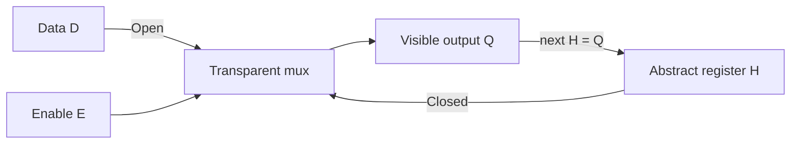
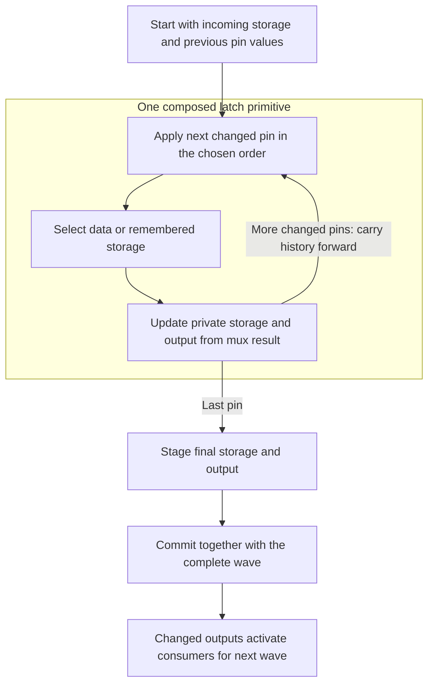

# Latch Event Behavior

This is a zero-delay Boolean model of latches, gates, and flip-flops. One
external transaction changes permitted inputs; internal events then propagate
until a complete, stable boundary is reached. Only those boundaries are
observed. The environment cannot interrupt an unfinished settling episode.
The [latch-support design](sec-latch-support.md) gives the proof obligations
and the distinction between current broad-region handling and safe local
scheduling.

## External transactions

An ordinary step is an input event, not a hardware clock cycle or one internal
wave. Enables can open and close between flip-flop edges, and data propagates
through an open latch without any clock edge.

By default, a transaction may change any number of external input bits,
including none. A restriction to at most one external bit per transaction is
a different environment assumption. It does not restrict internally generated
changes or remove their possible arrival orders. Both comparison designs
receive the same external stimulus and use the same event contract.

## Primitive behavior

### Basic latch primitive: register plus transparent mux

For an active-high latch without asynchronous controls, `H` is the remembered
bit, `D` the data, `E` the enable, and `Q` the visible output:

```text
Q       = E ? D : H
next(H) = Q
```


```mermaid
flowchart LR
    D[Data D] -->|Open| M[Transparent mux]
    E[Enable E] --> M
    H[Abstract register H] -->|Closed| M
    M --> Q[Visible output Q]
    Q -->|next H = Q| H
```

The register represents remembered history, not a flip-flop driven by a
hardware clock. The visible value is the mux result: open selects current
data; closed selects remembered storage.

The actual event model composes both operations into one primitive. For each
permitted ordering, changed pins are visited once each; every visit uses the
storage and pin history left by the preceding visit:


```mermaid
flowchart TD
    A[Start with incoming storage and previous pin values] --> P
    subgraph L[One composed latch primitive]
        P[Apply next changed pin in the chosen order] --> M
        M[Select data or remembered storage] --> R
        R[Update private storage and output from mux result]
        R -->|More changed pins: carry history forward| P
    end
    R -->|Last pin| S[Stage final storage and output]
    S --> W[Commit together with the complete wave]
    W --> N[Changed outputs activate consumers for next wave]
```

Only the ordering's final values are published at the wave boundary; intermediate
storage updates remain part of that primitive's history. These are the same
latch equations, but this correspondence does not prove equivalence to an
arbitrary separately scheduled register/mux decomposition. Splitting the blocks
can add waves, change capture ordering, or alter pulses seen downstream.

For example, start with `D=0, E=1, H=0`, then change data to `1` while closing
the latch. Data-first can retain `1`; close-first retains `0`. Both orders must
be considered. A unique-result claim cannot silently choose the favorable one.

Active-low latches reverse the enable polarity. Defined asynchronous clear or
preset rules override transparency. Physical outputs may invert stored state
or combine it with current inputs, as in an integrated clock gate. Undefined
or unsupported control combinations are errors if reached.

Gates compute their Boolean functions from the current wave's inputs.
Flip-flops instead apply their specified edge and asynchronous-control rules,
threading history through changed-pin visits; a later data visit cannot reuse
an earlier clock edge. No blanket clock-cycle update is applied to all storage.

## Initialization and propagation

Unspecified external inputs and storage begin as arbitrary Boolean values,
not assumed zero and not literal unknown-valued logic. Concrete restrictions
apply only when explicitly requested. Initial external levels are shared
between comparison designs; their internal storage origins are independent.

Initialization is itself a checked settling episode:

1. Project physical storage outputs from remembered state and the defined output
   expressions. Treat auxiliary internal-net seeds as arbitrary.
2. Set previous pin values equal to current values. Starting with a high clock
   does not fabricate a rising edge.
3. Force an initial evaluation: gates compute, latches apply transparency and
   asynchronous rules, and flip-flops apply asynchronous rules without an
   invented edge. Generated clock changes in subsequent waves are real events.
4. Require every auxiliary seed and permitted ordering to settle to the same
   complete boundary for each genuine input/storage origin. Different genuine
   origins may yield different boundaries; all remain represented.

A closed, unreset latch therefore keeps its unspecified history even when
other storage is reset. Initialization is not an implicit reset sequence.

For ordinary propagation, activated primitives read one frozen pre-wave
snapshot. Their final storage/output tuples commit together; changed nets
activate all consumers for the next wave. Independent evaluations can proceed
in parallel without their completion order choosing a capture. Each producer's
result is shared across its fanout. Intermediate pin visits are private, but
transitions between network waves are preserved.

### Reset-cycle adapter

A requested reset duration remains a count of complete clock cycles, not input
events. With one unambiguous source clock and one reset, the reset episode
composes already-settled event transitions:

1. Assert reset and settle; establish a low source clock and settle. Any
   alignment edge from an initially high clock is represented while reset is
   active.
2. For each requested cycle, sample all non-clock/non-reset inputs. Admit them
   together when simultaneous external changes are allowed; otherwise compose
   one-bit transactions covering every arrival order. Hold the sampled levels
   through both clock edges.
3. Drive the clock high and settle, then low and settle, completing that cycle.
4. After the final cycle, release reset and settle before observation resumes.

The two designs share these input and ordering choices. This is a cycle-sampled
reset environment, not arbitrary asynchronous activity inside a cycle. No clock
is guessed from signal names or latch enables. Multiple clocks or resets,
ambiguous clock roots, and latch-only designs need an explicit justified
schedule; a cycle request cannot silently become an event count. Afterward,
ordinary event transactions resume with reset held inactive.

## Regions and safety

Current whole-design handling groups every primitive connected through
internally driven data or control nets into broad event-connected regions.
Shared read-only external inputs alone do not join regions. Feedback groups
are also identified, but their size does not supply a settling bound, and a
flip-flop does not automatically cut generated-clock or asynchronous-control
dependencies. Certification currently covers each whole broad region; this
can make large, otherwise useful designs impractical to certify.

Safe event scheduling follows changed-net dependencies and preserves every
consumer-visible wave, including transient clock, enable, and asynchronous
control activity. Replacing broad regions with independently settled local
summaries requires a preservation argument; publishing only final region
outputs can lose consequential pulses. The latch primitive representation
does not itself establish that optimized scheduling is solved.

Certification requires error-free progress to stability under every admitted
transaction and internal ordering, plus one complete resulting state—not just
matching visible outputs. Complete state includes stored bits and remembered
net/pin values. Initialization must satisfy the same requirements,
and the accepted boundary set must remain closed under future transactions.
Feedback is accepted only when these obligations hold; a possible infinite
internal execution is not repaired by choosing a settling execution.

Bounded symbolic reasoning or exhaustive finite exploration can establish
these obligations. A failed bound or exhausted resources means unproved,
not necessarily oscillating. Unsupported or uncertified regions remain opaque
by default: affected outputs are excluded, not proved. A strict policy may
instead reject any opaque behavior. No troublesome event or initial origin is
discarded to manufacture success.

## Limits

This contract does not model propagation delays, setup/hold violations,
metastability, unknown/high-impedance logic, multiple drivers, or arbitrary
hardware/HDL scheduling. Broad-region certification remains a coverage and
scalability limitation; safe local reductions require additional justification.
