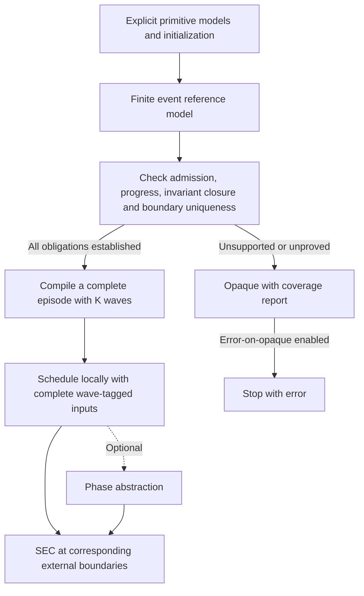
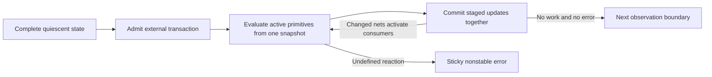

# Proposed SEC Latch Support

Status: architectural design and conditional correctness arguments, with the
deterministic Boolean-event path implemented behind the default-on `latch_support`
switch. Starting inputs and storage remain symbolic unless explicitly constrained;
initialization settings are not required and reset is never inserted implicitly.
The implementation, admission/initial-state semantics, symbolic
certifier, finite fallback, and scoped limitations are documented separately in
[SEC Latch Event Implementation](sec-latch-implementation.md). Optional phase
abstraction and stronger scheduling reductions remain extensions. This document records the
literature-backed approach discussed for level-sensitive latch support. It does
not itself enable latch extraction or change SEC results. The constructions and
proof sketches below close the identified specification gaps for a deliberately
restricted digital contract. They are not machine-checked proofs of an
implementation, or a claim to support every physical latch network.

The central distinction is between **modeling behavior** and **optimizing that
model**. Latch storage, transparency, event ordering, and internal propagation
must be defined first. Loop unfolding, local scheduling, parallel evaluation,
and phase abstraction are subsequent transformations with separate correctness
conditions. No single referenced paper proves this complete Kepler architecture.

## 1. Summary

The proposed pipeline is:

1. Extract explicit latch and flip-flop models, including asynchronous controls.
2. Build the finite, snapshot-based evaluate/update reference system in Section 5,
   preserving history and events between flip-flop clock edges.
3. Analyze data and control dependencies. Identify feedback components and
   candidate scheduling regions; these are different partitions.
4. Prove that each accepted settling episode terminates within a sufficient bound.
5. Compile supported internal propagation into bounded unfolded logic, preserving
   all relevant intermediate effects.
6. Schedule regions using complete, wave-tagged inputs as specified in Section 8;
   preserve intermediate events rather than publishing only settled endpoints.
7. Optionally apply periodic phase discovery and phase abstraction to the valid
   model, with their own observation-preservation conditions.
8. Compare the two designs at corresponding external observation boundaries,
   checking progress as well as output agreement.

The first compiled path additionally requires a unique complete boundary state
for each admitted initial state and transaction. The conservative fallback is
the existing opaque behavior, with explicit skipped-output coverage, or the
opt-in error policy in Section 11. A backend retaining internal steps would be
a separate extension, not a capability assumed here. Never choose an arbitrary
fixed point, assume convergence, or discard a non-settling execution.



## 2. Relationship to Current Kepler Behavior

Current documented behavior is described in
[SEC Sequential Models](sec-sequential-models.md) and
[SEC Clock Handling](sec-clock-handling.md). With `latch_support` disabled, or with
no latch-event settings supplied, generic latch outputs remain opaque. The switch
is enabled by default, but event modeling still requires explicit input-event and
initialization settings; it models only certified behavior. Existing clock
handling also has explicit limits on cross-domain cones.

This proposal would extend those semantics; it is not merely an extraction
optimization. In particular, modeling independent latch enables requires more
than attaching another state-update mux to the existing abstract clock tick.
The current clock-domain restrictions must not be removed until the replacement
semantics and coverage rules have been implemented and verified.

Naja's explicit sequential models should provide the element kind, data/state
expressions, enable or clock expression, clear/preset behavior, and physical
output mapping. Do not infer latch semantics from cell or pin names.

This is a frontend prerequisite, not an assumption that the current Liberty
reader already supplies every such model. Its latch/state-table support must
be addressed separately. Existing clock-tree name exclusions do not establish
latch semantics. Reusing a clock-carrier classifier also does not prove gate
stability, transparency through chains, or absence of active feedback.

## 3. Initial Semantic Contract

The first target is a **zero-delay digital model with explicit internal
propagation steps**, not a physical timing model.

- An external transaction supplies the next permitted input valuation or event.
  Clocks, latch enables, data, and asynchronous controls can change independently
  when allowed by the environment contract.
- New external stimulus is admitted only at a quiescent boundary. During the
  resulting settling episode, external values are held fixed while internal
  events continue to propagate.
- Quiescence means no remaining modeled work can change the state: pending
  updates and event/edge history must be accounted for, not just latch outputs.
- A transaction supplies Boolean external values and any declared ordering
  constraints. At a primitive activation, preserve every permitted ordering of
  changed input pins, as specified in Section 5. Do not silently select one
  order or impose a one-input-change restriction.
- The initial supported primitive set is Boolean, single-driver combinational
  logic plus explicitly modeled latches and flip-flops. Cell-specific
  clear/preset priority and invalid combinations must be defined. Unmodeled
  X/Z, multiple drivers, and missing primitive rules are unsupported, not
  don't-cares. Section 5 defines a distinct Boolean initialization contract.
- Observations initially occur at completed external transactions. Any internal
  event that affects stored state remains relevant even if outputs are observed
  only after settling.

There is no inferred physical sampling interval. A formal internal step advances
the event semantics, not necessarily a circuit clock. An independent enable
pulse between flip-flop edges can be represented by external transactions for
its opening and closing. This does not establish fidelity for arbitrary physical
pulses, gate delays, setup/hold violations, or metastability.

Allowing the external environment to interrupt an unfinished settling episode
would be a separate extension. The initial quiescent-environment contract must
be documented rather than mistaken for unrestricted asynchronous hardware.

## 4. Basic Latch Building Block

For a simple active-high latch, distinguish the remembered value H from the
visible output Q. The presentation [R1] gives the schematic construction:

    Q = enable ? data : H
    next(H) = Q

The register in this construction is mathematical storage. It is not a claim
that the physical latch samples on the main flip-flop clock.

When the latch is closed, its output is its remembered value. When open, changes
at its data input can change its output and activate downstream logic without
waiting for a flip-flop edge. Reset and preset semantics must be incorporated
from the actual primitive model.

These equations alone are not a complete network semantics. In a feedback
network, treating them as simultaneous unconstrained equations can lose history
or eliminate behavior. An open self-feedback latch can reduce to Q = Q, which
allows either value unless its previous state is preserved. Inverting feedback
can produce Q = not Q, which has no Boolean solution; excluding that case would
hide a problematic execution.

The reference model must therefore start propagation from the actual preceding
state and apply defined event rules. Closing a latch and changing its data in
the same transaction must use those rules, not an assumed universal old-data
or new-data convention.

Four open latches in a chain are not four clock cycles of delay. Their changes
propagate through internal evaluations within the same settling episode. The
eventually settled result is not a claim of zero physical propagation time.

## 5. Reference Internal-Step Transition System

The direct formal foundation is the VERICELL construction [R2], which models
primitive evaluation and updates and encodes them as a Boolean transition
system. Its published implementation makes restrictions that must not be
inherited implicitly; see the reference notes below.

### 5.1 Complete finite state and primitive contract

Select the following zero-delay barrier semantics as the reference. This is an
explicit digital contract derived from the operational structure in [R2], not
a claim of complete IEEE Verilog or physical-timing equivalence.

The state contains primitive storage, current and previous net values, active
evaluations, staged updates, initialization status, sticky errors, and any finite
environment monitor needed for later transactions. Each net has one writer;
multi-output primitives own an output tuple committed together. A wave has at
most one pending output tuple per primitive, so no unbounded event queue or
absolute time counter is required. A reference step is one complete wave,
not a worker dispatch or an arbitrary scheduler delay.

Every supported primitive supplies a complete finite reaction table: data and
control polarity, storage, clock edge, asynchronous clear/preset behavior,
conflicting-control behavior, and physical output mapping. An undefined or
unsupported case produces a sticky error, never an absent successor. Different
cell types need not share a universal reset priority.

At a quiescent boundary, admission copies the old current values into history,
atomically replaces external input values with the transaction's values, and
activates exactly their changed-net consumers. Internal values and storage are
initially unchanged; staged updates are empty. Update the finite environment
monitor once for the transaction, not once per wave. Hold the supplied external
values throughout the episode. Changes intended to occur at distinct settled
moments are separate transactions. In the absence of an explicit constraint,
simultaneous changes leave every local pin order permitted. Invalid admission
must produce an error rather than remove that transaction from the relation.

### 5.2 One ordinary evaluate/update wave

1. Freeze the complete current/previous snapshot for this wave. Every activated
   primitive reads that same snapshot; no worker reads another worker's staged
   result.
2. A combinational primitive stages its Boolean function of the current inputs.
   For a sequential primitive, begin with its remembered state and previous pin
   values. Process the changed pin positions in every permitted order. For each
   visited pin, apply its change once, then apply the primitive's reaction table
   to the resulting local pin vector and remembered state.
3. For a simple latch reaction, apply the specified asynchronous controls first;
   otherwise copy the local data value while enabled and retain storage while
   disabled. A flip-flop captures only on a visit to its clock pin that carries
   the specified edge, subject to its controls. Do not re-use that edge while
   subsequently visiting a data or enable pin.
4. Stage only the final primitive state/output tuple from that evaluation.
   Intermediate values inside its pin-processing sequence are private under
   this contract. This does not permit hiding changes between network waves.
5. Commit all staged updates together, set previous net values to the pre-commit
   current values, and clear the consumed activations and committed update
   buffer. Replace the active set with exactly the consumers of changed nets,
   including data, enable, clock, reset, and preset consumers. Inactive
   primitives retain state.
6. Continue if work remains. Otherwise normalize previous values to current
   values and mark a completed boundary, provided no error occurred. An idle
   region alone does not establish whole-episode quiescence.

The primitive-local recurrence is:

```text
b := previous input-pin vector
z := current primitive storage
choose a permitted ordering pi of changed pin positions
for each j in pi:
    before := b
    b[j] := current value of input pin j
    z := reaction(z, before, b, j)
stage z and its physical output tuple
```

The reference relation retains all permitted outcomes. Only after the
boundary-uniqueness check in Section 9 may a legal deterministic implementation
replace those alternatives. No pin-stability restriction may be inferred merely
from a primary input being held: internally generated changes remain possible.
Any such restriction must hold at the actual reference activations.

This resolves simultaneous-event ambiguity explicitly. An open latch whose data
changes as it closes can retain old data or capture new data depending on the
permitted pin order. A clock/data race can similarly change a flip-flop capture.
The accepted deterministic path rejects unresolved outcome dependence; it does
not silently choose whichever outcome makes two designs agree.



Do not freeze an internally generated control during settling. Conversely,
adding/removing gates or replacing a primitive with a decomposition can move
events between waves and change capture. Such rewrites need preservation
arguments; Boolean function equality alone is insufficient for event-sensitive
consumers. The primitive granularity is part of this reference contract.

### 5.3 Initialization is an actual settling episode

For the first proposed Boolean path, supply and hold an initial external input
valuation u0, and choose initial storage bits once under an explicit
initialization relation. Initialize their physical outputs consistently. Choose
declared Boolean seeds for the remaining internal nets, or quantify over all
such seeds; do not select a convenient stable solution. Set previous values
equal to current values for all initialized nets before the forced first
evaluation, including the external clocks.

Run a dedicated first evaluation: combinational functions evaluate; latches
apply their level-sensitive and asynchronous rules; flip-flops apply asynchronous
controls but otherwise retain their initial storage, without an invented clock
edge. Commit together, then use ordinary waves. A generated clock change caused
by that commit is an actual event under the chosen model and is processed.

Certify bootstrap progress and the resulting boundary invariant, just as for
later episodes. If only storage bits and initial external inputs are intended
initial parameters, compare bootstrap runs with those parameters shared but
auxiliary net seeds and permitted event choices independent. Require a unique
complete boundary result, or report unsupported. Otherwise arbitrary gate seeds
could silently decide which state is retained.

This is a Kepler-specific Boolean bootstrap, not the all-X initialization in
[R2]. A symbolic but fixed initial Boolean bit is not HDL X and is never
resampled during propagation. A future multivalued path needs its own explicit
rules, including genuine startup transitions that its edge semantics recognize.
It must not silently inherit the Boolean no-startup-edge convention. Existing
X-handling policy outside this proposed path is not changed by this document.

## 6. Feedback Components and Scheduling Islands

### Feedback components

Construct a dependency graph that includes both data and control paths. Strongly
connected components identify candidate feedback regions. A loop may contain
one latch, many latches, and intervening combinational logic.

A closed latch can break a transparent dependency for a particular condition.
To classify an entire feedback region as inactive, prove that every directed
cycle is broken under every admitted condition. Structural cyclicity alone
does not establish oscillation.

If controls change during the episode, acyclicity of an individual snapshot is
not by itself a termination proof. The complete event computation must still
satisfy the progress obligation; do not silently freeze changing controls when
using a structural shortcut.

A flip-flop's data-to-state update is normally a sequential boundary, but its
clock and asynchronous controls cannot be treated as unconditional cuts:
internally generated events on those pins can change its state during settling.

### Scheduling islands

A scheduling island may contain several feedback components and the acyclic
logic or latch chains connecting them. It need not equal a component being
unfolded. DeVane [R5] supplies a concrete precedent for trigger-based regions,
not a rule to merge everything that is connected.

Candidate grouping must account for enable, clock, reset, and data dependencies,
shared downstream storage, and pending-event effects. Two events that change
the same latch's data and enable are not independent simply because their
source logic belongs to separate graph components. Conversely, sharing a held,
read-only external input does not necessarily make two regions dependent.

### Why final outputs alone are insufficient

Suppose region A produces a temporary enable pulse for a latch in region B.
The enable starts and ends low, but the intervening high value lets B capture
data. Sending only A's final low value to B would lose that capture.

Either preserve the relevant boundary event sequence, enlarge the modeled
region while retaining those internal events, or prove that the intermediate
events cannot affect any required behavior. Merely merging regions does not
justify deleting their internal propagation history.

## 7. Certifying a Settling Bound

Unfolding replaces repeated applications of internal transition logic with a
chain of copies. It is built once during model construction and reused for each
external transaction. It is exact only after a sufficient bound is justified.

The finite-state eventuality result in [R3] provides the foundation: universal
eventual arrival at a target condition has a finite uniform bound, and checking
a candidate bound is a safety obligation. Finite state by itself does not imply
convergence; a reachable cycle can avoid stability forever.

For one settling episode, define:

    q                 complete quiescent boundary state
    B(q)              admitted boundary invariant
    Allowed(e, u)     shared environment's allowed transaction, with monitor e
    J(q, u, x0)       admission of the transaction, retaining every allowed outcome
    x                 complete internal state, including history and events
    u                 held external stimulus
    Entry(x, u)       all admissible episode-entry configurations
    T_hold(x, x', u)  one permitted internal transition with stimulus held
    Stable(x)         full quiescence

Entry describes the complete state immediately after admission of the new
external transaction, including its pending events or changed-value history.
The state and held stimulus must be consistent. Entry is not the quiescent
state before that transaction is applied.

The finite environment monitor is part of the complete state; the same
environment contract supplies both designs. Do not intersect two different
implementation-specific admissibility conditions to hide a disagreement.

Establish these obligations before using a bound:

1. Bootstrap covers the prescribed initial conditions and establishes B. It must
   not replace them with a convenient subset or an empty initial relation.
2. For every B(q) and Allowed(e, u), J has a successor. Unsupported admission
   produces an explicit error, not an absent transition. Establish this totality
   structurally or with a quantified/exhaustive check; it is not implied by the
   bounded SAT query below.
3. Every such admission satisfies Entry(x0, u), including all admitted choices.
4. T_hold is total. Stable states have identity successors, preserving the
   entire state, not merely the truth of Stable.
5. Every completed episode from B returns to B. Together with bootstrap, this
   supplies induction over arbitrarily many external transactions.

Make Stable absorbing within this episode. Totalize non-stable deadlocks and
modeled failures as absorbing error states for which Stable is false, or prove
separately that such states are unreachable. Short failing paths must survive
to depth K rather than disappear from the formula. For a candidate K, prove
the following formula unsatisfiable:

    Entry(x0, u)
      AND T_hold(x0, x1, u) AND ... AND T_hold(x[K-1], x[K], u)
      AND NOT Stable(x[K])

This is our proposed specialization of the published finite-state result, not
a latch-specific algorithm quoted from [R3]. It covers all represented entry
states and scheduling choices, not just states visited in a reset simulation.
An entry-state invariant or over-approximation must cover every reachable
episode entry; restrictions on impossible states require justification.

After proving the obligation, K copies of the same transition logic implement
the complete settling episode. Early completion is padded with identity steps.
All intermediate capture/reset effects are still computed inside those copies.

### Exact bounded-compilation theorem

Initially retain the complete quiescent reference state as the macrostate.
Removing a field requires a reconstruction or future-behavior preservation
proof; being irrelevant to the current outputs is not sufficient. Define:

```text
M(q, u, q_next) iff there exist x0, ..., xK such that
    J(q, u, x0)
    AND T_hold(x0, x1, u) AND ... AND T_hold(x[K-1], xK, u)
    AND q_next = xK
```

**Claim, under the obligations above:** M equals the reference relation from one
completed external boundary to the next, for states in B and allowed inputs.

**Proof sketch.** Every permitted reference episode reaches its first stable
state by K; identity padding extends it to length K without changing its result,
giving a witness for M. Conversely, every M witness reaches stability by K;
trimming its identity suffix yields a permitted reference episode with exactly
the same complete final state. Boundary-invariant closure permits concatenating
this argument, proving equality of boundary traces for any transaction sequence.
This is our relational-compilation argument using [R3, R4, R9], not a theorem
quoted verbatim from a latch-specific paper. Turning M into one next-state
function requires the separate uniqueness check in Section 9.

### A finite decision procedure, not a guessed depth

With frozen stimulus, explore the complete internal states reachable from the
episode entries. A reachable cycle entirely outside Stable gives a non-settling
execution. Otherwise the nonstable graph is acyclic, and its longest path to
stability supplies a sufficient K. The number of nonstable states is a coarse
upper bound, at most 2^b for a b-bit complete-state encoding. This is a finite
theoretical procedure, not a claim that exhaustive exploration is practical.

An implementation can search candidate bounds with the safety query, use
symbolic cycle checks, or use ranking proofs. Resource exhaustion means an
unproved/unsupported case. A failure found only from an over-approximate B or
Entry must be concretized before being reported as a reachable design defect;
a successful universal certificate over that over-approximation remains sound.

Alternatives include a decreasing ranking function or a liveness-to-safety
check for a non-quiescent repeating execution [R4]. Event history and pending
work matter when identifying repeated states. A proof of eventual convergence
does not by itself provide a convenient small numerical bound.

Important limits:

- A counterexample at depth K can mean only that more steps are needed.
- A timeout is an unproven bound, not a proof of convergence or oscillation.
- Fair eventual scheduling alone permits arbitrary postponement and does not
  establish a uniform bound on scheduler steps.
- Counting latches, taking graph depth through a cycle, or using an ordinary
  shortest-path reachability diameter is not a general bound on settling.
- A bound can be too large for useful unfolding.

Initially, certify complete event-connected episodes. Local bounds require
contracts describing incoming events, not an assumption that neighboring
regions stay fixed. Do not combine component bounds by an unjustified maximum
or sum and assume that the complete design is covered.

## 8. Safe Scheduling Reduction and Parallelism

### 8.1 First construction: preserve reference-wave epochs

Local scheduling need not mean changing the circuit's event order. Use the
following concrete construction, initially with the certified complete-episode
bound K from Section 7:

1. Partition primitive evaluations into islands using the full data/control
   dependency graph. SCCs may guide grouping but are not the correctness proof.
2. Associate every boundary value, relevant history, and activity indication
   with its reference wave number, or epoch. At epoch k an island reads only the
   complete epoch-k inputs and its epoch-k local state, producing epoch-(k+1)
   updates.
3. Each predecessor supplies either its value/update or an explicit
   unchanged/epoch-complete indication. Do not interpret silence as no change,
   and never combine input values from different epochs.
4. Preserve every relevant boundary transition. A pulse is an opening and a
   closing in their respective epochs, even when its final value equals its
   initial value. Lossless compression of unchanged intervals is permitted.
5. Schedule a computation only after all its input epochs are complete. Include
   shared error, quiescence, and environment monitors in this dependency rule;
   their reductions may require a barrier. A locally idle island must still
   receive later events and must not declare the episode globally stable.
6. Build or evaluate the finite epoch-indexed dependency graph through K. Every
   task completes once; worker waiting is not an extra circuit step. Identity
   padding is permitted only where it agrees with the reference, including its
   global stable/error guards.

For symbolic compilation these interfaces are epoch-indexed expressions and
activity guards, not necessarily runtime event queues inside the SEC machine.
Workers may evaluate independent tasks in parallel. Cross-island dependency
cycles are handled by successive epochs; they do not become same-epoch circular
equations. Computing each island's entire K-wave boundary trace in topological
order is another option only if the full inter-island dependency graph is
acyclic. Arbitrarily merging nonadjacent SCCs need not preserve that property.

**Preservation claim.** This construction has exactly the reference's full state
at each epoch, or the same set of full-state traces when primitive choices remain
nondeterministic.

**Proof sketch.** At entry, each island receives its exact projection of the
reference state. Assume equality at epoch k. The complete-input rule gives each
primitive the same activation, values, controls, and history as the reference;
it therefore has the same permitted staged updates. Unique output ownership and
the same monitor rules produce the same committed epoch-(k+1) state. Induction
proves equality through K. Nondeterministic choices retain their identities and
constraints across fanout; duplicating a producer must not create independent
copies of its choice. Matching choices gives both directions of trace inclusion.

This is our direct scheduling proof for the selected reference. It closes the
local-scheduling gap without assuming an island can settle atomically or relying
on a general partial-order-reduction theorem whose hypotheses were not checked.

**Why complete epochs matter.** Suppose two branches make a and b rise in the
same reference update, and their XOR enables a latch. The reference sees both
new values together, so the XOR stays low. A scheduler that reads one new value
and one old value invents an enable pulse and can change stored state. This
failure needs no feedback loop; finding SCCs alone does not prevent it.

### 8.2 Optional stronger reductions

Termination and order independence are separate properties. All schedules may
terminate yet produce different stored values. A single canonical schedule is
valid only if it is the declared reference semantics or is proven to represent
all permitted observable outcomes. Otherwise retain nondeterminism.

Confluence and partial-order reduction results [R6, R7] provide sufficient
conditions for selected scheduling reductions. Applying them here requires a
mapping from latch events to their formal hypotheses; an SCC partition is not
that proof.

For each proposed reordering, establish that it preserves activation conditions,
capture behavior, relevant observations, and progress. Read/write dependencies
must include control history, event enqueue/cancel effects, and shared monitors.
Only steps invisible under the declared observation contract may be hidden.
Matching final outputs alone is not enough to justify reordering or hiding.

McDonald and Bryant [R8] demonstrate local event queues for symbolic timing
simulation. Their timing assumptions and event-cluster definition differ from
the proposed zero-delay latch islands. This is an optimization reference, not
the correctness basis for the complete SEC model.

Practical parallelism can begin conservatively:

- Parallel extraction and independent graph analyses with deterministic results.
- Parallel primitive evaluations within a reference evaluation wave, reading
  the same immutable snapshot and staging updates for the same update barrier.
- Parallel proof jobs for independent regions with validated boundary contracts.

Do not let worker completion order determine latch capture. The epoch-preserving
construction above may compute an island's complete trace locally, but must
still expose its relevant boundary trace. Publishing only a final settled value
needs an additional proof that discarded transitions cannot affect external
storage, control-event detection, errors, or required observations, and that
retained state preserves all future observations. Atomic summaries, shortcuts
across epochs, and alternative scheduling semantics remain separate extensions.

## 9. Connection to SEC

The internal-round abstraction and transparent-latch example in [R9] support
the idea of grouping propagation into observations. The stronger progress and
interface-preservation obligations below are part of our proposed adaptation.

Supply both designs with the same allowed external transaction sequence. Each
design may require a different number of internal steps. Compare corresponding
completed observations, not identically numbered internal steps.

In a reference paired model, a design that finishes early waits at the boundary
while the other finishes; no new external transaction is accepted prematurely.
With certified bounded compilation, each side can instead expose its complete
episode as a boundary-to-boundary transition.

Two independent obligations are required:

1. **Progress:** every accepted episode completes within its certified bound,
   or an explicitly supported liveness analysis establishes completion.
2. **Agreement:** the required outputs agree at matched observation boundaries
   under the specified initialization/reset relation.

Only checking agreement when both designs finish can pass vacuously if a design
never finishes. A bound overflow must therefore be an error or unsupported
result, never an assumption excluding that execution.

### 9.1 A sufficient determinism check

For the first conventional SEC path, use a stronger, concrete condition than
same-episode output equality: prove uniqueness of the complete retained boundary
state. With the macro relation M from Section 7, require this query to be
unsatisfiable:

```text
B(q) AND Allowed(e, u)
    AND M(q, u, a) AND M(q, u, b)
    AND a != b
```

The two copies share the **pre-admission** state q and external transaction u,
but independently choose admission outcomes and all permitted primitive orders.
Sharing a particular post-admission x0 could hide nondeterminism in J. Initial
storage bits already belong to q; they are not independently resampled for the
two executions. Bootstrap separately checks auxiliary-seed independence as
specified in Section 5.3.

This test is conservative: two different internal states might still have the
same future observable behavior. Accepting them would require a proved
behavioral quotient or a separate all-future-observations check. Comparing only
the current output vector is insufficient; a later input may expose a hidden
latch-state difference. A failure on an over-approximate B is not automatically
a reachable design defect, but it prevents acceptance without refinement.

As another sufficient route, primitive pin-order independence for every admitted
activation implies deterministic waves under the unique-writer barrier model.
The local commutation results in [R2] support such checks. They do not establish
network termination, bootstrap independence, or regional abstraction by
themselves. The complete-boundary test can also accept cases where local
ambiguity disappears before the full state settles.

### 9.2 From a relation to ordinary sequential equivalence

Admission totality, certified progress, and boundary uniqueness make M a total
function on B and the allowed transactions. A compiler can retain the relation
or implement it using a legal deterministic selection of its choices, after
showing that the selection realizes M. Uniqueness does not validate arbitrary
new event rules or an independently written scheduler.

For two accepted designs, fix an explicit initial/reset relation R0 and a shared
environment transaction sequence. Each design uses its own compiled function
and its own certified K. An inductive paired-state invariant R must:

1. Contain all initial pairs prescribed by R0, including the bootstrap results.
2. Be preserved by both compiled transitions under every shared allowed input.
3. Imply equality of the required observations at corresponding boundaries.

Together with each design's independent progress certificate, these conditions
prove the stated SEC property by induction. They do not change the initial-state
quantification or establish equivalence under a different environment. Choosing
a favorable subset of initial pairs or implementation-specific input assumptions
would not prove the declared contract.

If complete-boundary uniqueness is not established, the first path reports
unsupported/opaque under Section 11. It does not align two arbitrary scheduler
choices merely to obtain equal outputs. General nondeterministic trace-set
equivalence is a separate extension, not a prerequisite of this construction.

Reset bootstrap and cycle counts must also distinguish external clock/reset
events from internal settling steps. An internal propagation round is not an
additional hardware reset cycle.

The macrostep here is an admitted external transaction, not automatically the
existing SEC clock tick. Connecting this construction to existing clock-cycle
observations, reset counters, and exporters requires an explicit adapter. A
cycle-level reduction may hide transactions only after preserving their capture
effects and the required observation relation. Until that adapter is established,
the mathematical construction must not be advertised as existing-backend support.

## 10. Optional Phase Optimization

Phase discovery [R10] belongs after construction of a valid transition system. It
cannot repair missed enable pulses, unspecified event order, or unsafe loop
handling.

The intended periodic-analysis layer starts from a normalized sequential
machine with an explicitly defined step, performs reset-based ternary analysis,
and looks for deterministic periodic state signals. It does not begin by
assigning a phase to each latch or grouping latches solely by syntactically equal
enables. A latch-specific adapter
can then interpret enable expressions relative to discovered carriers while
retaining residual local gating.

Scheduler activity is not automatically a hardware phase: a period measured in
internal propagation steps must not be interpreted as a circuit clock period.
The relationship between the selected transition-system step and SEC observation
boundaries has to be preserved.

Any subsequent phase abstraction needs its own observation-preservation
conditions. Failure to discover a periodic carrier is a valid outcome: retain
the unreduced model. Phase reduction is optional; generic latch semantics must
not depend on its success.

## 11. Unsupported Cases and Diagnostics

The proposed bounded-settling path cannot automatically accept:

- **Non-settling feedback.** For example, a known Boolean value circulating
  through an open latch and an inverter can alternate indefinitely under the
  chosen propagation semantics. Unknown-value initialization must not be used
  to disguise that case as a useful settled Boolean result.
- **Order-dependent boundary results.** This can occur with or without feedback.
  The first path requires complete-boundary uniqueness; failure or inability to
  prove it leaves the affected behavior unsupported, not arbitrarily resolved.
- **Unproven or impractical bounds.** A valid circuit may fall outside the
  resource limits of this compiler.
- **Unmodeled timing or primitives.** Physical delay-sensitive behavior,
  metastability, unresolved asynchronous-control rules, and unsupported
  multi-driver/unknown-value semantics are outside the declared contract.

A history-preserving self-feedback latch is not inherently unsupported. Several
stable values are also not inherently a problem when prior state and permitted
events determine which value is reached.

Diagnostics should identify the affected region, relevant latch/control paths,
the failed obligation, and the impacted observed outputs. Distinguish a proven
non-settling trace from an unproven bound and from a resource limit. Preserve
explicit checked-output coverage rather than representing skipped behavior by
free shared symbols or claiming a complete SEC pass.

### Default opaque behavior and optional error mode

Keep the existing opaque-handling policy as the default. A latch must no longer
be classified as opaque merely because it is a latch: model its behavior when
the strategy's semantic and proof requirements are satisfied. Latch behavior
that cannot be modeled safely remains opaque, as do other unsupported cells
and signals. Ordinary propagation of opacity through dependent logic still
applies.

By default, encountering opacity is not itself a fatal error. Preserve the
existing opaque diagnostics/reports and affected-output skipping behavior,
continue checking supported outputs, and report the resulting coverage. Skipped
outputs are not proved equivalent, and opaque signals must not be replaced by
unconstrained shared values to obtain a proof.

Propagate opacity through data and event/control dependencies, not only data
cones. Certificates for remaining dependency-closed modeled cones make no claim
about progress or equivalence of the excluded behavior. Reporting an unsupported
region is not permission to drop one of its executions inside a purported proof
of that region.

Add a separate opt-in error-on-opaque switch, **disabled by default**. When
enabled, encountering an opaque cell or signal during SEC model construction
for either design must stop the run with an error and a nonzero exit status,
rather than continuing with partial coverage. The diagnostic must identify the
design, hierarchical cell or signal, and reason for opacity. This policy applies
to opacity generally, not only to unsupported latches; it does not change which
behavior the modeling strategy supports. The implemented spellings are
`--error-on-opaque` and YAML/Python `error_on_opaque`, independently default-off.

## 12. Proposed Implementation and Validation Stages

The stages below remain the design's acceptance checklist. The core Boolean
implementation realizes stages 1-5 with explicit primitive callbacks, BOOT,
concrete and symbolic waves, dependency regions, SAT certificates, and bounded
compilation. Stage 6 uses an explicit **external-transaction** backend adapter:
native SEC, witnesses, and BTOR2 share that step meaning. Reset bootstrap uses
an automatic cycle adapter for the supported single-clock/single-reset subset:
assert reset, sample unconstrained data, generate both clock edges with full
settling, and release reset after N complete cycles. It never counts propagation
waves as cycles. Ambiguous clock protocols and selected leaf boundaries remain
unsupported; see the implementation document for the exact reset input-arrival
contract and diagnostics. Stage 7 remains optional, as originally proposed. See the implementation
document for exact supported frontend and resource boundaries.

The entire latch path remains behind `latch_support`, default-on. Explicit YAML
`latch_support: false`, CLI `--no-latch_support`, or Python `latch_support=False`
disables it. Default enablement does not assume initial values or input timing:
without any event settings, legacy SEC/LEC behavior is preserved. A complete
contract activates event modeling; partial contracts or tuning without the
required fields are errors, as is tuning while explicitly disabled. With the
switch off or no event settings supplied, reset uses the existing bootstrap
implementation unchanged; the event adapter's additional clock/reset
restrictions do not apply to legacy runs.

1. Encode and review the explicit primitive tables, Boolean bootstrap, shared
   environment, and observation contract specified here; supply missing frontend
   models without inventing semantics from names.
2. Implement a small executable reference model and symbolic transition encoder
   with the same evaluate/update and sticky-error rules.
3. Establish bootstrap progress, admission totality, and boundary invariants.
   Support acyclic propagation and provably inactive loops before active-loop
   certification; these still require correct data/control event handling.
4. Implement the bounded-progress and boundary-uniqueness checks, then exact
   bounded compilation. Validate that compiled transitions realize the reference
   macro relation, including all retained state and error effects.
5. Implement epoch-complete regional compilation/parallel scheduling and validate
   the per-wave preservation argument. Stronger atomic summaries remain optional.
6. Integrate paired observations, the cycle/reset adapter, exporters, coverage,
   and the default-off error-on-opaque policy with SEC.
7. Add optional phase abstraction or stronger scheduling reductions only with
   their own observation-preservation conditions.

Essential regressions include:

- Open/closed latch behavior and a chain of four simultaneously open latches.
- Self-feedback retaining both possible previous Boolean values.
- Complementary-enable feedback with a provably closed path.
- A known-state inverting loop that cannot settle.
- A convergent example needing more than the first attempted bound.
- Simultaneous data/enable or data/clock changes under the explicit contract.
- A flip-flop clock edge consumed once, not reused on a later data-pin visit.
- Bootstrap with an initially open latch, independent auxiliary net seeds, and
  generated clock events, without a fabricated initial flip-flop edge.
- Internally generated enable/reset/clock pulses that capture state, including
  pulses crossing a proposed island boundary.
- Equal final boundary signals but different transiently captured state.
- Reconvergent same-wave changes without mixed-epoch enable pulses.
- Shared nondeterministic producer choices preserved across island fanout.
- Equal current outputs but hidden latch states distinguishable by a later input.
- Different internal settling depths on equivalent designs.
- One side failing to settle, preventing a vacuous equivalence result.
- Missing admission successors and short error paths that must not disappear
  from the bounded query; independent admission choices in uniqueness checks.
- Explicit X/reset behavior, unproven-bound reporting, and partial coverage.
- Supported latches becoming modeled while unsupported latch behavior remains
  opaque, with existing diagnostics and affected-output skipping by default.
- Error-on-opaque disabled by default, and explicit enablement producing an error
  for an opaque cell or signal in either design, including non-latch opacity.
- Identical semantics and results under different worker counts.

Differential simulation is useful for examples, but does not replace universal
bound, scheduling-preservation, and observation-correspondence obligations.

## References and What They Establish

### R1. Hjort: latch building block and modeling pitfalls

Håkan Hjort, *On Applying Model Checking in Formal Verification*, FMCAD 2022
tutorial. [Presentation](https://fmcad.org/FMCAD22/presentations/00%20-%20tutorials/02_hjort.pdf).
Printed slides 38-41 discuss the common discrete time base and sequential
elements; slide 41 gives the latch state/bypass construction; slides 44-50
discuss feedback and delta propagation. This reference is the tutorial slide
deck, not the separate one-page published tutorial abstract. It motivates the
building block and its hazards, not a universal safe sampling interval or a
general settling bound.

### R2. Raffelsieper, Roorda, Mousavi: explicit formal event semantics

Matthias Raffelsieper, Jan-Willem Roorda, MohammadReza Mousavi,
*Model Checking Verilog Descriptions of Cell Libraries*, ACSD 2009, pp. 128-137.
[Publication record](https://research.tue.nl/en/publications/model-checking-verilog-descriptions-of-cell-libraries).
[DOI](https://doi.org/10.1109/ACSD.2009.18).
[Indexed author PDF](https://www.cs.le.ac.uk/people/mm789/pub/mousavi_acsd_2009.pdf).
The author PDF's indexed text was available during review, but direct download
returned an error; the publication record is included as a stable locator.

An accessible later author treatment is Matthias Raffelsieper's 2011 TU Eindhoven
dissertation, *Cell Libraries and Verification*, Chapter 3, printed pp. 15-31,
explicitly based on the 2009 paper.
[University PDF](https://pure.tue.nl/ws/files/3499974/717717.pdf#page=24).
[Repository record](https://research.tue.nl/en/publications/cell-libraries-and-verification).
This is a later treatment, not the identical conference article.

For the selected reference, the detailed anchors are Chapter 3, Section 3.1,
printed pp. 20-25 (pin-order evaluation and Table 3.2's operational rules), and
Section 3.2, printed p. 27 (the implementation's fixed-order restriction).
Chapter 4, Section 4.1 gives local order-independence/commutation checks. These
do not automatically prove settling or safe island abstraction. Chapter 5's
translation of timing restrictions through combinational input logic has
additional assumptions; such restrictions must be checked on the actual
activations of our wave model. The Boolean bootstrap and preservation proofs in
this proposal are explicitly our adaptations, not claims made by the thesis.

Sections 2-3 of the conference paper define primitive/history semantics,
execute/update iteration, and a Boolean transition-system encoding. Section 4
compares stable outputs and separately checks eventual stability. The published
encoding is zero-delay and
fixes a UDP input-processing order. Its example equivalence checks restrict
external changes and treat X outputs as don't-cares. Those choices are not
implicit Kepler defaults. Experiments concern cell libraries, not proof of
whole-design scalability.

### R3. Claessen and Sörensson: proving finite bounds

Koen Claessen and Niklas Sörensson, *A Liveness Checking Algorithm that Counts*,
FMCAD 2012, pp. 52-59.
[Proceedings, paper](https://www.cs.utexas.edu/~hunt/fmcad/FMCAD12/fmcad2012.pdf#page=59).
Section III-A, printed p. 53 (PDF p. 60), states the finite-state eventuality
bound; Section III-B develops the related k-liveness result. It supports
checking a proposed settling bound as a safety obligation. Applying it to a
complete, history-preserving latch episode is our specialization. It does not
provide a small bound from the number of latches.

### R4. Schuppan and Biere: checking progress through safety

Viktor Schuppan and Armin Biere, *Efficient Reduction of Finite State Model
Checking to Reachability Analysis*, STTT 5, 2004, pp. 185-204.
[Author preprint](https://www.schuppan.de/viktor/VSchuppanABiere-STTT-2004.pdf).
Sections 2 and 6 describe and justify state-recording reductions of liveness to
safety. This is the extended, corrected follow-up to *Liveness Checking as
Safety Checking* (Biere, Artho, Schuppan, 2002). It supplies a formal route for
detecting non-settling executions; it does not establish that a latch circuit
converges or that the proof is inexpensive.

### R5. DeVane: trigger-based circuit regions

Charles J. DeVane, *Efficient Circuit Partitioning to Extend Cycle Simulation
Beyond Synchronous Circuits*, ICCAD 1997, pp. 154-161.
[Paper](https://cecs.uci.edu/~papers/compendium94-03/papers/1997/iccad97/pdffiles/03a_1.pdf).
Sections 3.5-3.7 and 4 treat generated clocks, asynchronous controls, transparent
latches, and trigger-based partitioning. The principal algorithm assumes no
combinational feedback; separate handling is discussed. This is a scheduling
precedent, not a proof of bounded latch-loop unfolding or of our SEC adaptation.

### R6. Lang and Mateescu: compositional scheduling reduction

Frédéric Lang and Radu Mateescu, *Partial Order Reductions using Compositional
Confluence Detection*, FM 2009; full report INRIA RR-7078.
[Official publication page](https://cadp.inria.fr/publications/Lang-Mateescu-09.html).
The report gives conditions for lifting local confluence through composition
and prioritizing suitable acyclic invisible transitions while preserving
branching equivalence. These are conditional proof tools, not automatic
permission to serialize arbitrary latch regions.

### R7. Neele, Valmari, Willemse: observation-preserving reduction

Thomas Neele, Antti Valmari, Tim A. C. Willemse, *A Detailed Account of the
Inconsistent Labelling Problem of Stutter-Preserving Partial-Order Reduction*,
Logical Methods in Computer Science 17(3), 2021.
[Paper](https://lmcs.episciences.org/7709/pdf).
Section 5 gives corrected conditions and proofs for stutter-trace preservation.
Its counterexamples explain why endpoint agreement alone is insufficient when
intermediate state observations matter. Our observation mapping must satisfy
the selected reduction's conditions.

### R8. McDonald and Bryant: local symbolic event queues

Clayton B. McDonald and Randal E. Bryant, *Symbolic Timing Simulation Using
Cluster Scheduling*, DAC 2000, pp. 254-259.
[Author PDF](https://www.cs.cmu.edu/~bryant/pubdir/dac00a.pdf).
Section 3.2 describes local event queues and ordering safeguards. Event clusters
in this work are not synonymous with latch-loop components. Its symbolic
timing model is an optimization reference, not a direct correctness theorem for
our proposed zero-delay SEC frontend.

### R9. Alur and Henzinger: internal rounds and round abstraction

Rajeev Alur and Thomas A. Henzinger, *Reactive Modules*, Formal Methods in System
Design 15, 1999, pp. 7-48.
[Paper](https://www.cis.upenn.edu/~alur/FMSD99.pdf).
Section 6.2, printed pp. 37-38 (PDF pp. 31-32), Figure 13, explicitly treats
transparent-latch feedback and internal stabilization. Sections 6.1 and 6.3
provide round abstraction and triggering. This supports combining internal
rounds under stated conditions; it does not prove universal bounded convergence
for arbitrary latch networks. In particular, its round-marker continuation
condition must not be substituted for our stronger all-executions progress
obligation.

### R10. Bjesse and Kukula: later phase abstraction

Per Bjesse and James Kukula, *Automatic Generalized Phase Abstraction for Formal
Verification*, ICCAD 2005.
[Author PDF](http://www.perbjesse.com/iccad05.pdf).
[DOI](https://doi.org/10.1109/ICCAD.2005.1560220).
Section II assumes clock/latch modeling and combinational-loop resolution have
already occurred. Its periodic analysis and abstraction operate on that
normalized machine. It supports the optional optimization layer, not the
construction of correct arbitrary-latch event semantics.

## Resolved Algorithmic Choices and Remaining Work

The previously open construction is now specialized as follows:

- **Reference semantics:** finite, single-writer Boolean primitives;
  snapshot-based waves; permitted pin-order alternatives retained; complete
  cell-specific control rules; explicit Boolean bootstrap and sticky errors.
- **Compilation:** total admission and internal transitions, an inductive
  boundary invariant, a certified all-executions bound, identity padding, and
  retention of complete boundary state. Section 7 supplies the exactness proof.
- **Local scheduling:** complete epoch-tagged inputs, preserved boundary events
  and choice correlations, with the per-wave induction in Section 8. Atomic
  settle-and-publish islands are not assumed.
- **SEC:** complete-boundary uniqueness before deterministic compilation;
  shared external transactions and explicit initial relation; independent
  progress and paired-observation obligations, as specified in Section 9.
- **Fallback:** unsupported behavior stays opaque by default, with existing
  reporting/skipping; error-on-opaque is a separate default-off switch.

These close the logical construction under the stated hypotheses; they are not
a machine-checked theorem or a proof that arbitrary asynchronous hardware
satisfies those hypotheses. The explicitly configured event implementation now
instantiates the primitive tables, bootstrap, reference and symbolic compilers, certificates,
dependency regions, resource limits, and SEC reset/export adapters, with tests
described in [the implementation document](sec-latch-implementation.md).
Tests and per-component SAT certificates do not establish that this Boolean
contract models every physical circuit. The environment/initial-state contract
must remain explicit in user configuration; it must not be inferred to make a
proof succeed.

Extensions still requiring separate arguments include genuine multivalued
semantics, input changes before an episode settles, physical timing and
metastability, nondeterministic trace-set equivalence, atomic regional summaries,
and transformations that alter primitive granularity or internal event order.
The cited research supports the foundations; the short specialization proofs
here are our own and remain subject to implementation validation.
