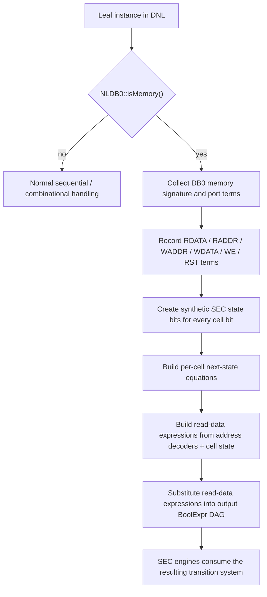
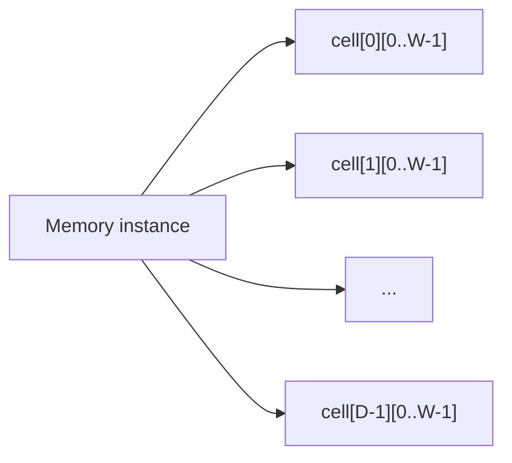
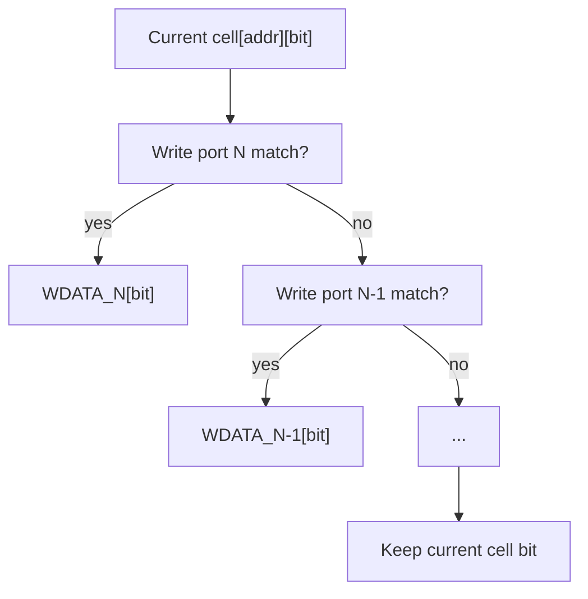
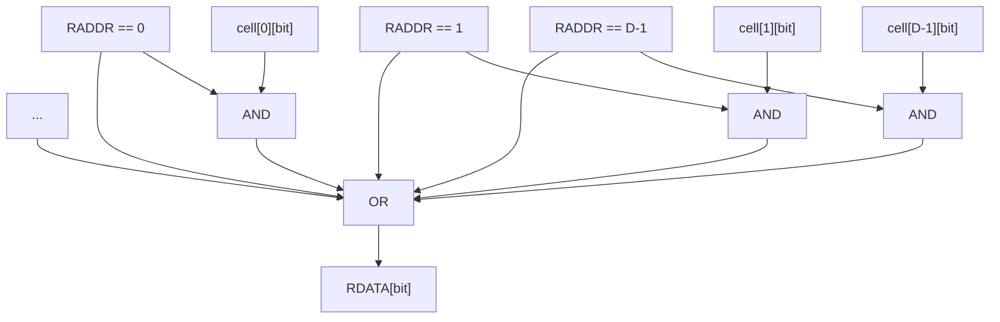

# SEC Memory Modeling

This document explains how the current SEC flow models memories in
`kepler-formal`.

Status:

- current implementation
- intended to describe what the code does today
- especially relevant for large designs like CVA6

## Overview

The SEC memory model does **not** treat a supported memory as an opaque
boundary.

Instead, the extractor:

1. identifies a memory instance through Naja DB0 memory semantics
2. records the memory interface terms
3. creates synthetic state bits for every memory cell bit
4. builds next-state equations for those cell bits
5. rebuilds each read-data bit as a function of the synthetic memory state
6. substitutes that read expression back into the SEC Boolean boundary

So the proof engine sees a real sequential model of the memory, not just
an uninterpreted black box.

## High-Level Flow



## What Gets Extracted

For each supported memory instance, the extractor records:

- read-data bits: `RDATA`
- read-address bits: `RADDR`
- write-address bits: `WADDR`
- write-data bits: `WDATA`
- write-enable bits: `WE`
- reset bit when present: `RST`
- memory shape:
  - `width`
  - `depth`
  - `abits`
  - `readPorts`
  - `writePorts`
  - reset mode / polarity
  - initial bits when available

The in-memory extraction record is `PendingMemoryInstance` in
`src/sec/model/SequentialDesignModel.cpp`.

## State Model

The current model bit-blasts the memory array into synthetic SEC state bits.

If a memory has:

- depth = `D`
- width = `W`

then the extractor creates:

- `D * W` synthetic state bits

Each synthetic key represents one memory cell bit:

```text
mem_cell[addr][bit]
```

Conceptually:



This is why memory support increases the SEC state space significantly:
the memory is turned into real sequential state.

## Write Semantics

For each cell bit, SEC builds a next-state expression.

Ignoring reset for a moment, the update rule is:

```text
cell'[addr][bit] =
  if any write port writes this address:
    selected WDATA[bit]
  else
    cell[addr][bit]
```

Write ports are modeled from back to front so the last processed matching
write port wins inside the nested `if-then-else` structure.

Address matching is decoded explicitly from the write-address bits.



With reset enabled, the model wraps the write logic:

```text
cell'[addr][bit] =
  if reset_active:
    init_bit_or_0
  else
    write_or_hold_expr
```

For async-reset memories with known init bits, the extractor may also seed
initial state values directly.

## Read Semantics

Read-data bits are rebuilt as functions of the synthetic cell state.

For each read port and bit:

```text
RDATA[bit] =
  OR over all addresses:
    (RADDR == addr) AND cell[addr][bit]
```

Conceptually:



After these expressions are built, they are substituted back into the
existing SEC Boolean expressions so the rest of the flow sees normal
combinational formulas.

## Why The Boundary Counts Grow So Much

The large counts seen in SEC logs are **not** just top-level inputs and
outputs.

There are several layers:

1. `BuildPrimaryOutputClauses::collect()` raw boundary terms
2. sequential state outputs that appear on the builder input side
3. dependency terms needed to rebuild next-state functions
4. memory port terms needed to model reads and writes
5. synthetic memory cell state added after extraction

With memory modeling enabled, the extractor must keep all of these memory
dependency terms alive:

- all `RADDR` bits
- all `WADDR` bits
- all `WDATA` bits
- all `WE` bits
- optional `RST`

That means even before the proof starts, the builder may be asked to
materialize a much larger internal boundary.

For a memory with:

- width `W`
- address bits `A`
- `R` read ports
- `P` write ports

the explicit port contribution is roughly:

```text
R * W                 read-data bits
+ R * A               read-address bits
+ P * A               write-address bits
+ P * W               write-data bits
+ P                   write-enable bits
+ optional reset
```

And then synthetic state adds:

```text
depth * width
```

more state bits.

That is why CVA6 sees a large surge after memory modeling: the design is not
getting more top I/O, but the SEC transition system is getting much richer.

## Current Strengths

- Supported memories are no longer forced into boundary abstraction.
- Read data is connected to real modeled state.
- Writes, holds, and reset behavior are part of the transition relation.
- The proof engines can reason about memory behavior, not just around it.

## Current Cost / Limitations

The current model is correct in spirit, but it is expensive.

Main reasons:

- eager dependency collection for memory ports
- eager bit-level memory state construction
- explicit address decoder expansion for reads and writes
- substitution of rebuilt memory reads into larger output formulas

So the current bottleneck on large designs is often **extraction and Boolean
materialization**, not the proof engine itself.

## Practical Reading Of CVA6 Logs

When CVA6 logs show very large input/output counts, read them as:

- internal SEC modeling frontier

not as:

- top-level chip interface size

That distinction matters when evaluating performance work. A runtime
optimization for CVA6 should usually target:

- dependency pruning
- lazy memory expansion
- smaller initial materialization sets

before changing the proof engine.
